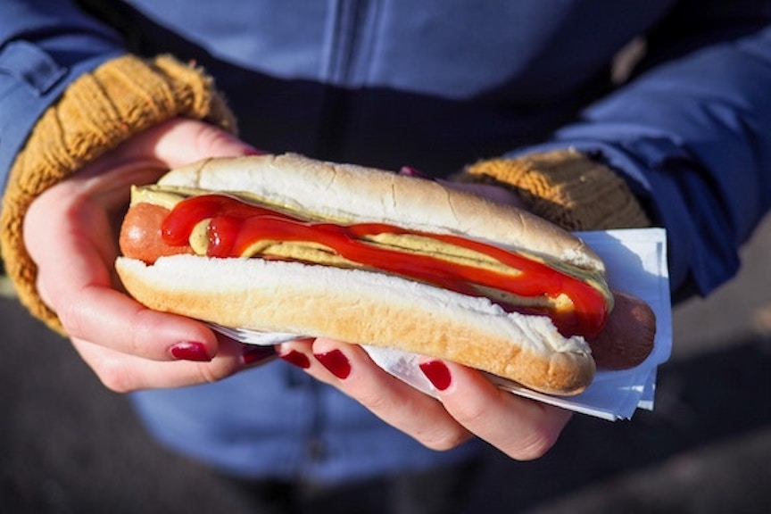

## Law and the Lemonade Stand {data-background=markus-spiske-s05XKB6jK2c-unsplash.jpg data-background-size=cover}

- Consider the simplest possible business: [a lemonade stand](https://www.economist.com/united-states/2015/07/09/is-lemonade-legal)
  - _Should_ the police have shut them down?

# What is "law"? 

## Should the law do something here? {data-background=mountains2.jpg data-background-size=cover}
Lindsey Paradise is not selected for her sorority of choice at the University of Kansas. She has spent all her time rushing that particular sorority, which chooses some of her friends but not her. She is disappointed and angry and wants to sue the sorority. What are her prospects of recovery in the legal system? 

## Should the law do something here? {data-background=mountains2.jpg data-background-size=cover}
In 2015, many boxing fans paid a substantial sum to view the "Fight of the Century" between Floyd Mayweather Jr. and Manny Pacquiao. The fight turned out to be a snoozer, perhaps because Pacquiao had an undisclosed injury. Many people were upset and decided to sue. Should the court order a refund because the fight was not as good as expected?

## Should the law do something here? {data-background=mountains2.jpg data-background-size=cover}
"Trade dress" is an intellectual property term describing the appearance of a product, identifying its source. The US Patent and Trademark Office registered as trade dress to Al Johnson's Swedish Restaurant the image of goats on a roof. An attorney unrelated to the restaurant challenged this grant, alleging it is "demeaning to" goats and "denigrates the value he ... places on the respect, dignity, and worth of animals.” Should the attorney be allowed to bring this lawsuit? If not, who will speak for the goats?

## Schools of legal thought, briefly {data-background=mountains2.jpg data-background-size=cover}

- <em>Legal positivism</em>: law is what the sovereign commands
- <em>Natural law</em>: find universal moral order
- <em>Legal realists</em>: law depends on judges whims, social context, etc
- <em>Critical legal studies</em>: law flows from power, law is politics

Practice on next slides: which school of legal thought is represented?

# Anatole France said, "The law, in its majesty, forbids rich and poor alike from sleeping under bridges"

# In Pirates of the Carribean, Admiral Norrington says "Vile and           dissolute creatures, the lot of them. I intend to see to it that           any man who sails under a pirate flag, or wears a pirate brand, gets what he deserves ...."

# When Nazi Adolf Eichmann was placed on trial, he claimed he was "just following orders" 

# Benjamin Franklin said "Laws too gentle are seldom obeyed; to severe, seldom executed"

## Legal reasoning in a nutshell  {data-background=mountains2.jpg data-background-size=cover}
- What is the <em>Issue</em>?
- What is the <em>Rule</em>?
- What is your <em>Analysis</em>? (Apply the facts to the Rule)
- What is your <em>Conclusion</em>?

## IRAC practice {data-background=mountains2.jpg data-background-size=cover}

Is a hot dog a sandwich?

## IRAC practice {data-background=mountains2.jpg data-background-size=cover}

Is a hot dog a sandwich?

We need a rule. [The Cube Rule will do.](https://web.archive.org/web/20200206220623/https://cuberule.com/)

# IRAC: Is there a sense in which non-governmental entities, such as a church or social group, exercise "law"?

## Sources (and priority) of law {data-background=mark-rabe-zCJrolkwRyE-unsplash.jpg data-background-size=cover}

- Constitutions (as interpreted by Supreme Courts)
- Statutes
- Regulations (also called "rules", just to be confusing)
- Court decisions
  - _Note: These also give you the list to workdown to find legal rules. First, does a constitution speak to the question? Next, does a statute? And so on._

# How to Read a Court Case:   <a href="https://jlingwall.github.io/LegalEnvironment/s04-06-a-sample-case.html">Harris v. Forklift Systems</a>

<!-- # Further excercises:   <a href="../s04-07-summary-and-exercises.html">Should time permit </a>
 -->
<!-- ## Class Procedure

Now that substance is done

- Syllabus
- Pictures with names
- Extra credit -->

<!-- 'f' enable fullscreen mode -->

<!-- 'w' toggle widescreen mode -->

<!-- 'o' enable overview mode -->

<!-- 'h' enable code highlight mode -->

<!-- 'p' show presenter notes -->
