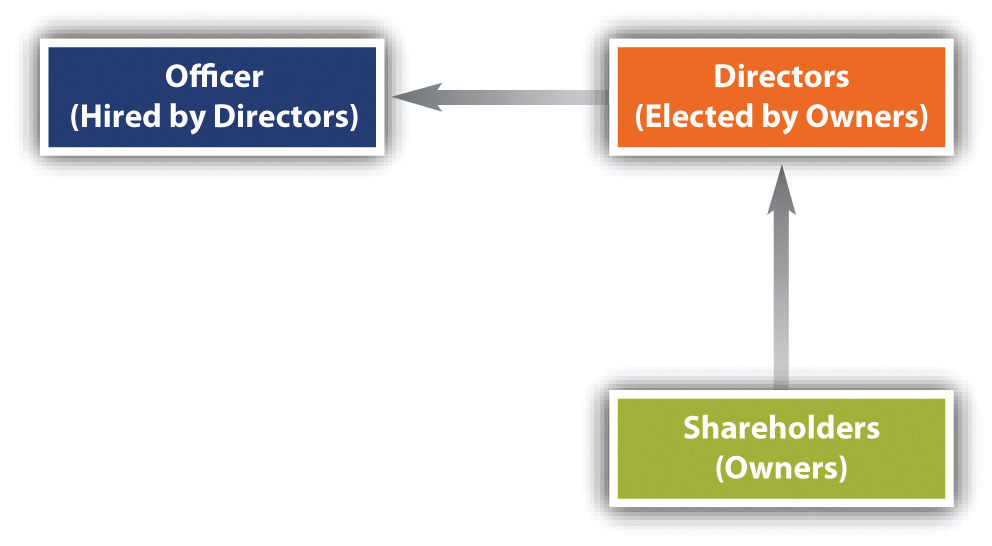

## Ethics is not the law

- Slavery, for years
- Slack fill
- Contracts versus promises
- Adverse employment actions not based on Title VII

Why then do we study it?

# In the spirit of "natural law", can we build a consistent theory of ethics from scratch?

# 
<iframe width=50%  src="https://www.youtube.com/embed/ut0ai4s4mjU" frameborder="0" allow="accelerometer; autoplay; encrypted-media; gyroscope; picture-in-picture" allowfullscreen></iframe>

## Universally "bad" behavior? {data-background=mark-rabe-zCJrolkwRyE-unsplash.jpg data-background-size=cover}
Remember IRAC: do we need a definition of "bad" first?

## Universally "good" behavior? {data-background=mark-rabe-zCJrolkwRyE-unsplash.jpg data-background-size=cover}
Definition of good, first?

## Can we assign these points? {data-background=mark-rabe-zCJrolkwRyE-unsplash.jpg data-background-size=cover}

# This is _utilitarianism_

# As a utilitarian, I should give everyone in this class an A. To not would be unethical.

##  Utilitarianism in a nutshell  {data-background=wouter-salari-6eZgtpXdlDk-unsplash.jpg data-background-size=cover}

<ul>
<li> Act in a way that delivers the greatest good for society</li>
<li> But good for whom?</li>
<li> And can we measure it?</li>
<li> And over what time horizon?</li>
<li> And what if there is value in suffering?</li>
<li> And can we  live with the paralyzing consequences?</li>
</ul>

## Would it be easier to just follow a set of rules?
- This is _deontology_
- We may follow rules from religion, or principles of rights, or philosophy
    - E.g., Kant's "categorical imperative"
  
## Would it be easier to just follow a set of rules?
- This is _deontology_
- We may follow rules from religion, or principles of rights, or philosophy
    - E.g., Kant's "categorical imperative"
- But this has it's own set of of problems:
    - What if the rules are bad?
    - What if they don't cover a situation?
    - What if the rules lead to strange results?
        - E.g., is choosing not have children unethical by the categorical imperative?

## Would it be easier to just follow a set of rules?
- This is _deontology_
- We may follow rules from religion, or principles of rights, or philosophy
    - E.g., Kant's "categorical imperative"
- But this has it's own set of of problems:
    - What if the rules are bad?
    - What if they don't cover a situation?
    - What if the rules lead to strange results?
        - E.g., is choosing not have children unethical by the categorical imperative?
- Should we consider "virtue" alone?
    - Which virtues?
    - What if they conflict? E.g., liberty and equality?

#
<iframe width="560" height="315" src="https://www.youtube.com/embed/lDnO4nDA3kM?start=0&end=58" frameborder="0" allow="accelerometer; autoplay; encrypted-media; gyroscope; picture-in-picture" allowfullscreen></iframe>

# How does   this  apply   to companies? {data-background=sean-pollock-PhYq704ffdA-unsplash.jpg data-background-size=cover}

## Stakeholder analysis
- Identify the stakeholders: potential gainers and losers
- For a corporation, we need to consider

 

## Corporate Social Responsibility
Corporate Social Responsibility (CSR) says companies should consider the needs of all stakeholders (employees, community, customers, environment, etc), rather than just attempting to maximize shareholder profit

- Can corporations legally do this?
- Is it in their long-term, strategic interest?
- What about <a href="https://www.kingarthurflour.com/about/mission-impact">"benefit corporations"</a>?
- Or <a href="https://bcorporation.net/">"certified B-Corps"</a>?

## Practice
> - On a sheet of paper, list your favorite brand
> - What do you know about their CSR practices?
> - What can you find out in five minutes?
> - Does this make you more likely to buy from this company?

# Further excercises:   <a href="../s05-05-summary-and-exercises.html">Should time permit </a>

<!-- 'f' enable fullscreen mode -->

<!-- 'w' toggle widescreen mode -->

<!-- 'o' enable overview mode -->

<!-- 'h' enable code highlight mode -->

<!-- 'p' show presenter notes -->
