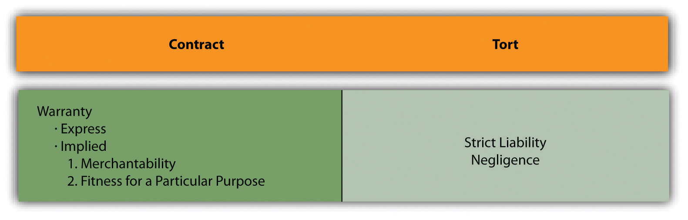
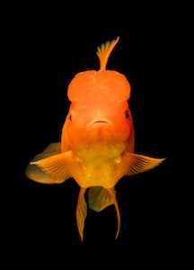
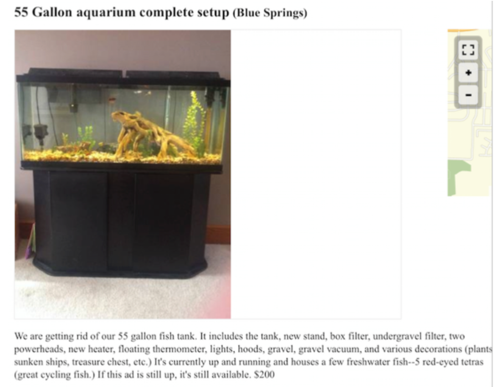
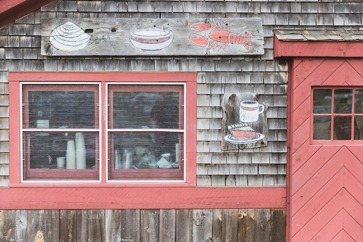
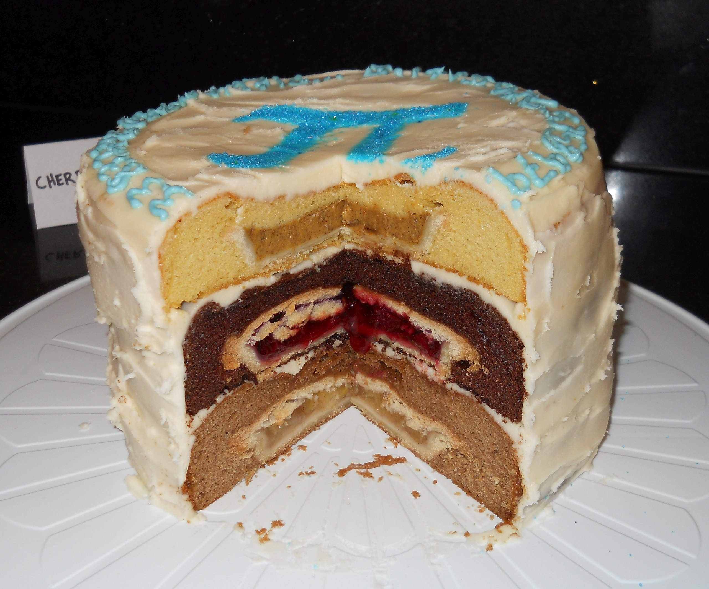

<!-- Overall style -->

<!-- Text color -->

<!-- Background images -->
<!-- concrete.jpg mountains.jpg skyline.jpg roadmap.jpg parrot.jpg blackdunes.png-->
<!-- If you use parrots, specify this under body p in the css notes:   width: 750px; -->
<!-- {data-background=skyline.jpg data-background-size=cover} -->
<!-- 

Footer text

 -->

## {data-background=blackdunes.png data-background-size=cover}

 
Product liability theories 

## Consider the following .... {data-background=blackdunes.png data-background-size=cover}

>- Primal Vantage Co. makes tree stands for hunting. A friend of Kevin O'Bryan's installed one of these stands on a tree trunk with five polypropylene straps.
>- O'Bryan then left it on the tree for <em>five years</em>
>- O'Bryan then climbed into the stand, which broke. He was paralyzed

## Consider the following .... {data-background=blackdunes.png data-background-size=cover}

>- The stand had come with warnings- use a safety harness, and don't leave it out all year
>- Should the company be liable?

## Consider the following .... {data-background=blackdunes.png data-background-size=cover}

- The court ruled that Primal Advantage failed to warn specifically that the straps might wear out if left outside
- But that O'Bryan was also at fault
- So he recovered $9 million, not $18 million

# Welcome to the world of product liability!

## Elements of product liability {data-background=blackdunes.png data-background-size=cover}

(1) One who sells any product in a defective condition unreasonably dangerous to the user or consumer or to his property is subject to liability for physical harm thereby caused to the ultimate user or consumer, or to his property, if <em>(a)</em> the seller is engaged in the business of selling such a product, and <em>(b)</em> it is expected to and does reach the user or consumer without substantial change in the condition in which it is sold.

(2) This rule applies even though <em>(a)</em> the seller has exercised all possible care in the preparation and sale of his product, and <em>(b)</em> the user or consumer has not bought the product from or entered into any contractual relation with the seller.

## Strict Products Liability Theories {data-background=blackdunes.png data-background-size=cover}

- Design defect
	+ Was it unreasonably dangerous?
	+ Remember: some products are inherently dangerous, and that's okay
- Manufacturing defect
- Failure to warn

## Strict Products Liability Defenses {data-background=blackdunes.png data-background-size=cover}

- Statutes of limitations
- Expert user
- Unforseeable use
- Product was modified

## Practice! {data-background=blackdunes.png data-background-size=cover}

Should there be product liability? If so, on what theory?

1. Cut by a knife?
2. Topical gel warns to stop using if discomfort is caused, but doesn't warn that severe burns may occur?
3. Carpenter drill warns not to be used as a dental drill?
4. New design for umpires mask that focuses energy towards the brain?
5. Soda bottle that explodes in your hand?
6. Forklift has safety feature disabled?
7. Snowmobile "backup beep" fails to sound when in reverse (purpose of the beep was to warn others, not to indicate gear shift)?

# Warranty

#
<iframe width="560" height="315" src="https://www.youtube.com/embed/8C-e96m4730" frameborder="0" allow="accelerometer; autoplay; encrypted-media; gyroscope; picture-in-picture" allowfullscreen></iframe>

# What is American Tourister saying here?  {data-background=blackdunes.png data-background-size=cover}

# Is this part of a contract?  {data-background=blackdunes.png data-background-size=cover}

## The Big Idea {data-background=blackdunes.png data-background-size=cover}

- A warranty is a promise, like in <em>contract</em>
- Yet is often involuntary, like in <em>tort</em>

## The Big Idea {data-background=blackdunes.png data-background-size=cover}

1. These are created by the UCC
2. They come in four flavors
	+ Warranty of title
	+ Express warranties
	+ Warranty of fitness for a particular purpose
	+ Implied warranty of merchantability
3. They are  <em>powerful</em>
4. And for some reason, we will illustrate each with <em>fish</em>

## Warranty of title, § 2-312 {data-background=blackdunes.png data-background-size=cover}

[T]here is in a contract for sale a warranty [promise] by the seller that (a) <em>the title conveyed shall be good, and its transfer rightful;</em> ...

[This] will be excluded or modified only by specific language or by circumstances which give the buyerreason to know that the person selling does not claim title in himself ....

It's like poetry ....

# Someone sells you a fish, which they stole.

## Express warranty, § 2-313 {data-background=blackdunes.png data-background-size=cover}

Express warranties by the seller are created as follows: <em>Any affirmation of fact or promise</em> made by the seller to the buyer which relates to the goods and becomes part of the basis of the bargain creates an express warranty that the goods shall conform to the affirmation or promise. ...

It is not necessary to the creation of an express warranty that the seller use formal words such as "warrant" or "guarantee" ....

Puffery is not fact or promise! "It's a beauty" means (1) it's probably not, or (2) absolutely nothing!   

## Practice

## Warranty of fitness, § 2-315 {data-background=blackdunes.png data-background-size=cover}

Where the seller at the time of contracting has reason to <em>know any particular purpose</em> for which the goods are required and that the <em>buyer is relying on the seller's skill or judgment</em> to select or furnish suitable goods, there is unless excluded or modified under the next section an implied warranty that the goods shall be fit for such purpose.

# You ask for an aquarium, and are sold a terrarium?

## Implied warranty of merchantability, § 2-314 {data-background=blackdunes.png data-background-size=cover}

(1) Unless excluded or modified ..., a warranty that the goods shall be merchantable is implied in a [every] contract for their sale <em>if the seller is a merchant</em> with respect to goods of that kind....

(2) Goods to be merchantable must be at least such as (a) pass without objection in the trade under the contract description; and ... (c) are <em>fit for the ordinary purposes</em> for which such goods are used ....

A merchant is someone who deals in goods of the kind, or is an expert in the goods

# A new pair of shoes falls apart within a week, with a "no return" policy?

## Just for fun {data-background=blackdunes.png data-background-size=cover}

- How does this apply to food?
- <em>Webster v. Blue Ship Tea Room</em> (Yes, back to fish.)
- What would a reasonable person would expect in their food?

## Behold, the cherpumple {data-background=blackdunes.png data-background-size=cover}

- Worm in the apple?
- Pit in the cherry?
- Hamburger in the pumpkin?

