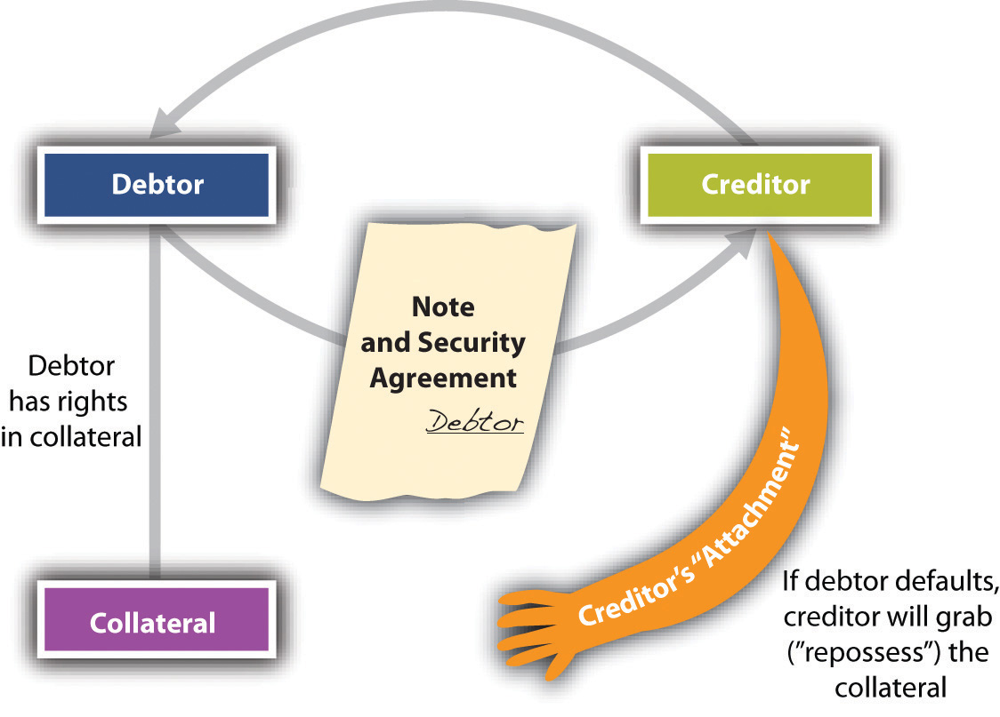
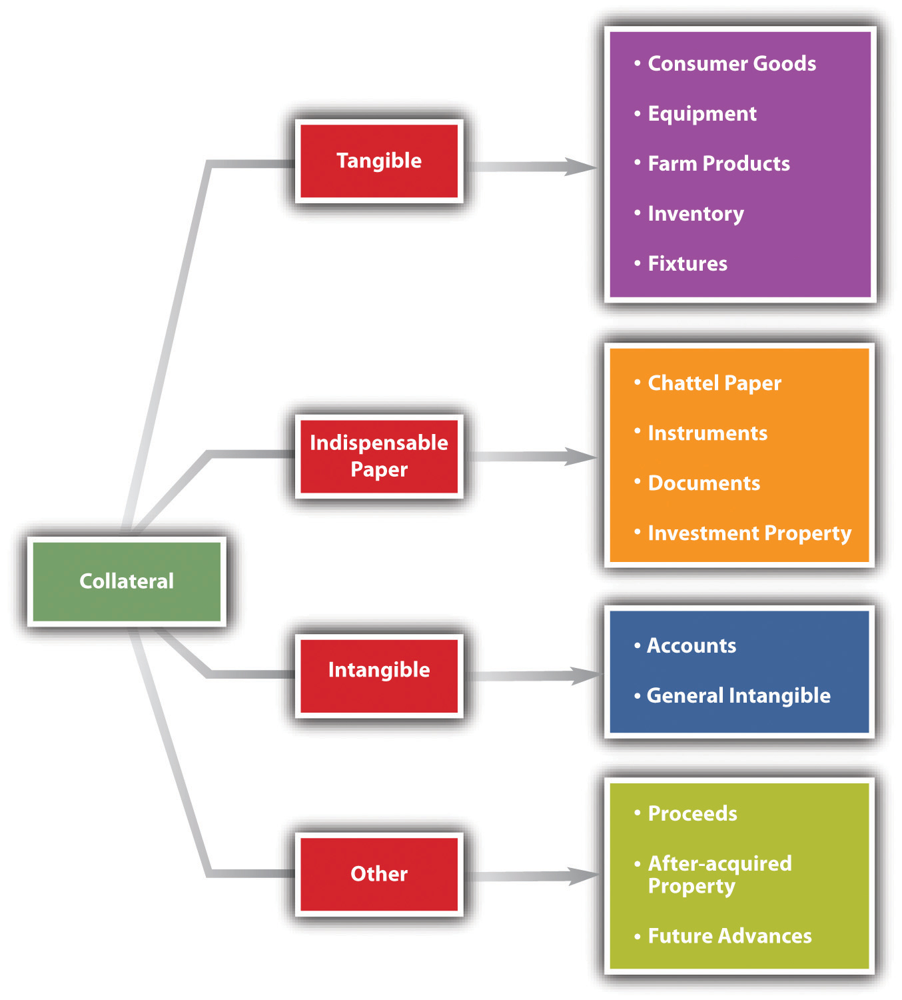
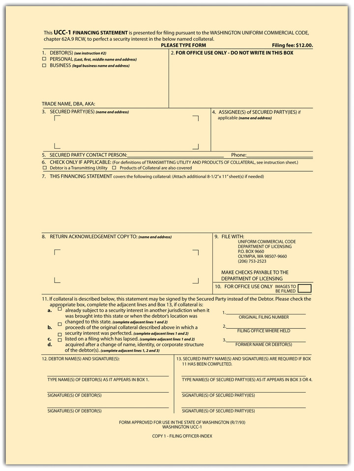
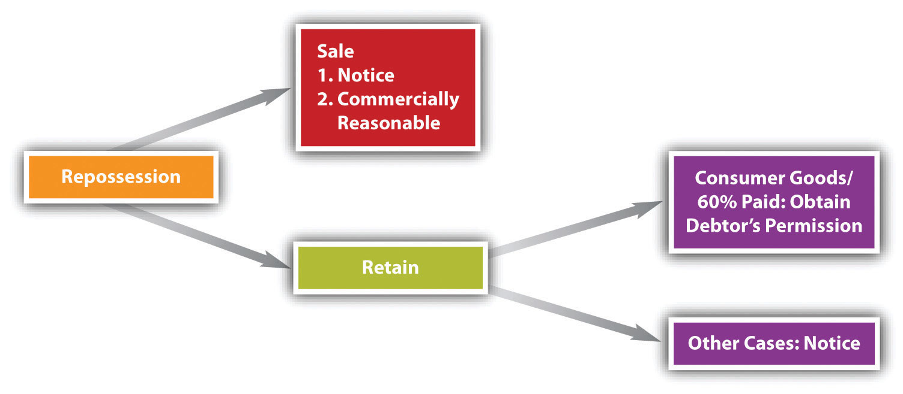

<!-- Overall style -->

<!-- Text color -->

<!-- Background images -->
<!-- {data-background=skyline.jpg data-background-size=cover} -->
<!-- concrete.jpg mountains.jpg skyline.jpg roadmap.jpg-->

<!-- 'f' enable fullscreen mode -->
<!-- 'w' toggle widescreen mode -->
<!-- 'o' enable overview mode -->
<!-- 'h' enable code highlight mode -->
<!-- 'p' show presenter notes -->

## The problem {data-background=mountains.jpg data-background-size=cover}

Suppose you and I make a contract. You love the class, and so when I come to you with an exciting business opportunity, you loan me $100,000. I promise to pay it back, subject to terms and conditions. 

## The problem {data-background=mountains.jpg data-background-size=cover}

Suppose you and I make a contract. You love the class, and so when I come to you with an exciting business opportunity, you loan me $100,000. I promise to pay it back, subject to terms and conditions. 

Rather than pay it back, I flee to the backwoods of Northern Canada. How do you recover the loan? Contract law isn't very helpful at this point.

## The problem {data-background=mountains.jpg data-background-size=cover}

Suppose you and I make a contract. You love the class, and so when I come to you with an exciting business opportunity, you loan me $100,000. I promise to pay it back, subject to terms and conditions. 

Rather than pay it back, I flee to the backwoods of Northern Canada. How do you recover the loan? Contract law isn't very helpful at this point.

You might find it more **secure** to tie the loan to an existing piece of collateral that would, e.g., be difficult to move to Canada. You might wish to make this a **secured transaction**.

## Another problem {data-background=mountains.jpg data-background-size=cover}

Suppose now that _you_ decide to borrow money to start a business. You wish to borrow money from two different lenders. Having learned from your mistakes on the prior slides, you suggest that the lenders can have your home if you default.

But now you have another problem: in case of default, _both_ lenders want the proceeds from sale of the home. They are each nervous about the other lender.

## Another problem {data-background=mountains.jpg data-background-size=cover}

Suppose now that _you_ decide to borrow money to start a business. You wish to borrow money from two different lenders. Having learned from your mistakes on the prior slides, you suggest that the lenders can have your home if you default.

But now you have another problem: in case of default, _both_ lenders want the proceeds from sale of the home. They are each nervous about the other lender.

It might be useful if the law established some sort of priority among these parties, and generally let people know if assets were already tied down as collateral. **Secured transaction** law will provide this.

# 

## Some definitions {data-background=mountains.jpg data-background-size=cover}

Article 9 of the UCC (as enacted by states) governs secured transactions

- **Security interest**: an interest in personal property or fixtures which secures payment or performance of an obligation
- **Collateral**: means the property subject to a security interest 
- **Purchase-money security interest (PMSI)**: arises when the debtor gets credit to buy goods and the creditor takes a secured interest in those goods
- **Secured party**: a person in whose favor a security interest is created or provided for under a security agreement

# 

## Attachment ... {data-background=mountains.jpg data-background-size=cover}

 ... is the term used to describe when a security interest becomes enforceable against the debtor with respect to the collateral.

1. the secured party gives value; 
2. the debtor has rights in the collateral or the power to transfer rights in it to the secured party; 
3. the parties have a security agreement “authenticated” (signed) by the debtor, or the creditor has possession of the collateral. 
	+ The writing needs to describe the collateral with reasonable certainty
	+ If the secured party takes possession of the collateral, a writing is not necessary

## Attachment ... {data-background=mountains.jpg data-background-size=cover}

How specific do you need to describe the collateral? Specific is usually better. The UCC has several categories of goods that are sufficient as well:

- "All debtor's equipment"
- "All debtor's inventory"
- But _not_ "all debtor's consumer goods" (overly broad and punitive)

## Repossession {data-background=mountains.jpg data-background-size=cover}

Once a security interest is attached, new legal remedies come into play. For example, upon default the secured party can seize the collateral to satisfy the debt. The secured party does not need a court order, so long as the repossession does not breach the peace.

- Breach
	+ Using friends in the police to do the work
	+ Violence / threats of violence
	+ Breaking a window to open a door
	+ Refusing to leave property after being told to do so

## Repossession {data-background=mountains.jpg data-background-size=cover}

Once a security interest is attached, new legal remedies come into play. For example, upon default the secured party can seize the collateral to satisfy the debt. The secured party does not need a court order, so long as the repossession does not breach the peace.

- Not breach
	+ Sneaking into a yard at night and racing off
	+ Cutting a lock when agreement allows
	+ Burning rubber before debtor objects

## Priority among multiple lenders {data-background=mountains.jpg data-background-size=cover}

The same piece of collateral may secure multiple loans, and so the law needs a way to sort them out.

1. If both parties have "perfected" (next slide), the first to perfect wins.
2. If one has perfected and one attached, the perfected party wins. 
3. If both have attached without perfection, the first to attach wins. 
4. If neither has attached, they are unsecured creditors. (_See_ bankruptcy law!)

## Perfection {data-background=mountains.jpg data-background-size=cover}

Perfection puts the world on notice of your security interest, and so gives you higher rights in collateral.

1. File a financing statement with the Secretary of State of the debtor
	+ States have searchable databases one can consult before making a loan
2. Take possession or control of the collateral

Certain items of collateral have different filing systems. E.g., counties record mortgages, states have special rules for liens on cars, etc.

#

## Automatic perfection {data-background=mountains.jpg data-background-size=cover}

Some security interests will automatically perfect. For example, a PMSI in consumer goods. When lending, you have little way to know if something like this exists without really doing your research before making a loan.

## Other rules on priority {data-background=mountains.jpg data-background-size=cover}

Sometimes the UCC has special rules for priority for certain kinds of collateral. For example, the UCC provides that a perfected PMSI in **inventory** has priority over conflicting interests in the same inventory, provided the the PMSI is perfected when the debtor receives possession of the inventory, the PMSI-secured party sends an authenticated notification to the holder of the conflicting interest, etc.

This could arise when, e.g., you have a general inventory lender with rights in "all debtors inventory and after-acquired inventory."

## Other rules on priority {data-background=mountains.jpg data-background-size=cover}

A "buyer in the ordinary course" will take free of even a perfected security interest, so long as the security interest was created by the buyer's seller.

(They will not take free of a prior security interest, so it can be difficult to purchase goods and be _absolutely_ sure there are no prior rights!)

## Proceeds {data-background=mountains.jpg data-background-size=cover}

A security interest will continue in the proceeds from collateral, and from the proceeds of proceeds, and so on!

#
<iframe width="560" height="315" src="https://www.youtube.com/embed/TdUsyXQ8Wrs" frameborder="0" allow="accelerometer; autoplay; encrypted-media; gyroscope; picture-in-picture" allowfullscreen></iframe>

## Proceeds {data-background=mountains.jpg data-background-size=cover}

What stops everything from becoming proceeds? The secured party needs to be able to trace back to the original collateral.

## Secured party's rights upon default  

## Secured party's rights upon default {data-background=mountains.jpg data-background-size=cover}

Suppose the collateral has greatly increased in value. Can the secured party simply keep it rather than disposing of it through sale? Yes, if they send a writing to the debtor, who does not object.

## One caution ...  {data-background=mountains.jpg data-background-size=cover}

Repossesssions can go bad. (Go to YouTube and search for "reposession gone wrong." It's shocking.) Upset debtors can trash collateral and then have few other assets the creditor can seize. This leaves lenders little recourse against them! Proceed with caution ....

