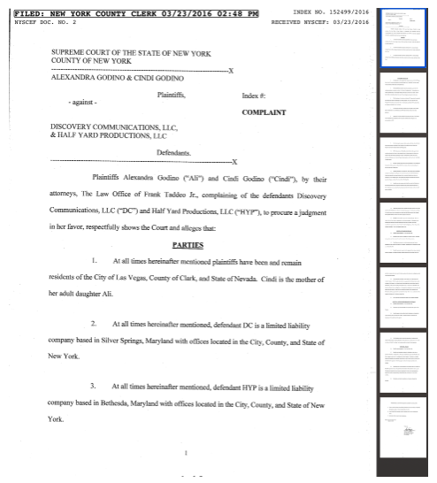
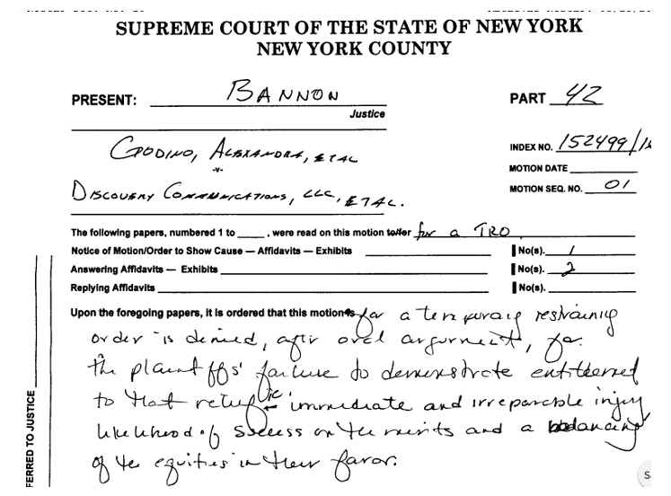

# 
<iframe width="560" height="315" src="https://www.youtube.com/embed/gjO1tPx2NBU" frameborder="0" allow="accelerometer; autoplay; encrypted-media; gyroscope; picture-in-picture" allowfullscreen></iframe>

## How can we dig deeper?

## 

## 

## 

## 

## 

## 

## 

## 

## 

## Should the court grant a restraining order?

Temporary restraining order. (a) Generally. If, on a motion for a preliminary injunction, the plaintiff shall show that **immediate and irreparable injury**, loss or damages will result unless the defendant is restrained before a hearing can be had, a temporary restraining order may be granted without notice.

## 

  

# <a href="https://www.independent.ie/style/weddings/this-brides-wedding-was-ruined-as-say-yes-to-the-dress-aired-her-episode-before-her-big-day-34575814.html">The dress!</a>

## Civil Procedure 101

## Courts need "jurisdiction" to decide a case {data-background=mark-rabe-zCJrolkwRyE-unsplash.jpg data-background-size=cover}
- Original versus appellate
- Personal and subject matter
- State versus federal

## Federal Appellate Courts

## Alternate Dispute Resolution
- Mediation
- Arbitration

# <a href="../s06-09-cases.html">More practice</a>, if time permits

<!-- 'f' enable fullscreen mode -->

<!-- 'w' toggle widescreen mode -->

<!-- 'o' enable overview mode -->

<!-- 'h' enable code highlight mode -->

<!-- 'p' show presenter notes -->
