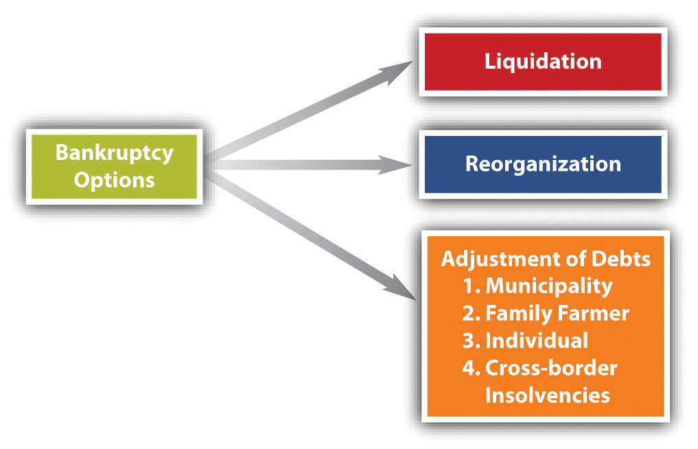
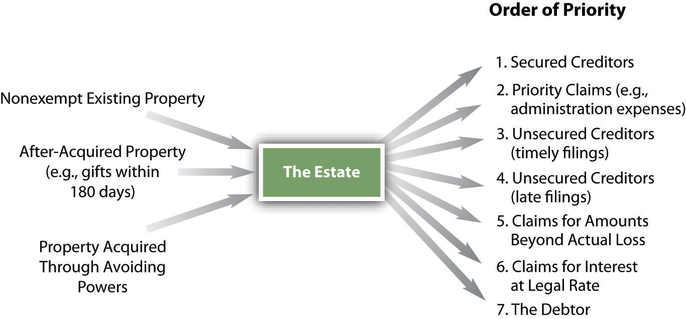

<!-- Overall style -->

<!-- Text color -->

<!-- Background images -->
<!-- {data-background=skyline.jpg data-background-size=cover} -->
<!-- concrete.jpg mountains.jpg mountains2.jpg skyline.jpg roadmap.jpg -->

<!-- 'f' enable fullscreen mode -->
<!-- 'w' toggle widescreen mode -->
<!-- 'o' enable overview mode -->
<!-- 'h' enable code highlight mode -->
<!-- 'p' show presenter notes -->

## Motivation {data-background=mountains2.jpg data-background-size=cover}

People, and businesses, sometimes find themselves in financial trouble. Medical bills, market trouble, unemployment, and so on. If they owe others money, we used to put them in debtor's prison, where they faced starvation, torture, etc. 

Now, we have the bankrupcty process.

## Background {data-background=mountains2.jpg data-background-size=cover}

Bankruptcy law governs the rights of creditors and insolvent debtors who cannot pay their debts. In broadest terms, bankruptcy deals with the seizure of the debtor’s assets and their distribution to the debtor’s various creditors. The term derives from the Renaissance custom of Italian traders, who did their trading from benches in town marketplaces. Creditors literally “broke the bench” of a merchant who failed to pay his debts. The term <em>banco rotta</em> (broken bench) thus came to apply to business failures.

## Background {data-background=mountains2.jpg data-background-size=cover}

The Constitution gives Congress the power to regulate bankruptcy. It's had a hard time. Congress passed bankruptcy laws in 1800, 1841, and 1867. These lasted only a few years each. In 1898, Congress enacted the Bankruptcy Act, which together with the Chandler Act amendments in 1938, lasted until 1978. In 1978, Congress passed the Bankruptcy Reform Act, and in 2005, it adopted the current law, the Bankruptcy Abuse Prevention and Consumer Protection Act (BAPCPA). This law is the subject of our chapter.

## Purposes {data-background=mountains2.jpg data-background-size=cover}

1. Give the debtor a fresh start
	+ Discharge debts, reorganize business, etc
2. Treat creditors equitably
	+ Make sure the important debts are paid first, before assets are exhausted

## Options 

## "Chapters" {data-background=mountains2.jpg data-background-size=cover}

Chapter 7, **Liquidation**: applies to all debtors except railroads, insurance companies, most banks and credit unions, and homestead associations. A liquidation is a “straight” bankruptcy proceeding. It entails selling the debtor’s nonexempt assets for cash and distributing the cash to the creditors, thereby discharging the insolvent person or business from any further liability for the debt. 

## "Chapters" {data-background=mountains2.jpg data-background-size=cover}

Chapter 11, **Reorganization**: applies to anybody who could file Chapter 7, plus railroads. It is the means by which a financially troubled company can continue to operate while its financial affairs are put on a sounder basis. A business might liquidate following reorganization but will probably take on new life after negotiations with creditors on how the old debt is to be paid off. A company may voluntarily decide to seek Chapter 11 protection in court, or it may be forced involuntarily into a Chapter 11 proceeding.

## "Chapters" {data-background=mountains2.jpg data-background-size=cover}

Chapter 12, Adjustment of debts of a **family farmer or fisherman** with regular annual income.11 United States Code, Section 109(f). Many family farmers cannot qualify for reorganization under Chapter 13 because of the low debt ceiling, and under Chapter 11, the proceeding is often complicated and expensive. As a result, Congress created Chapter 12, which applies only to farmers whose total debts do not exceed $1.5 million.

## "Chapters" {data-background=mountains2.jpg data-background-size=cover}

Chapter 13, Adjustment of debts of an **individual with regular income**: applies only to individuals (no corporations or partnerships) with debt not exceeding about $1.3 million.11 United States Code, Section 109(e). This chapter permits an individual with regular income to establish a repayment plan. 

(Why not just choose Chapter 7? It can be easier to keep your home, and if you have sufficient income creditors can force you from 7 to 13.)

# Bankruptcy Procedure

#
<iframe width="560" height="315" src="https://www.youtube.com/embed/C-m3RtoguAQ" frameborder="0" allow="accelerometer; autoplay; encrypted-media; gyroscope; picture-in-picture" allowfullscreen></iframe>

## Bankruptcy Procedure {data-background=mountains2.jpg data-background-size=cover}

In a nutshell ....

1. File a **petition**. This often occurs in the Spring, as tax refunds are used to pay attorneys to handle
	+ This can be voluntary or involuntary
	+ For involuntary, regulation sets the limit, e.g., of one creditor owed at least $13,475
2. An **automatic stay** goes into effect. Debt collection efforts stop!
	+ If a creditor is concerned that an asset might be destroyed, such as an uninsured yacht facing a hurricane, they can move to lift the stay.
3. A **trustee** is appointed. The trustee can use or sell the debtor's property, resolve fraudulent disposition of assets, etc.
	+ The trustee will be paid out of the estate, so if it is a "no asset" bankruptcy, they risk not being paid for their time
4. **Creditors** meet.
5. **Claims are resolved in priority order**

## Exempt property  {data-background=mountains2.jpg data-background-size=cover}

Some property will _not_ be sold during bankruptcy. There are state, and federal exemptions, with limitations. E.g.,

- Homestead
- Burial plots
- Your car
- Household goods
- Tools of the trade
- Jewelry

**If you've granted a security interest in any of these, you lose the exemption for that item!**

## Priority of payment

(Secured creditors receive up to amount of the sale of collateral, what debt remains is considered unsecured.)

## Order of priority claims {data-background=mountains2.jpg data-background-size=cover}

(A partial list)

1. Domestic support obligations
2. Administrative expenses (e.g., the trustee)
3. "Gap" creditors (claims between filing and order of relief)
4. Employee wages (though there will be petitions to allow continued, regular pay of employees during the bankruptcy process)
5. Consumer deposits
6. Taxes
6. DUI claims

## Fraudulent Claims {data-background=mountains2.jpg data-background-size=cover}

If the debtor disposed of property to avoid paying creditors, it can be recouped by the trustee. E.g., you sell a sportscar to your brother for $1 to avoid having it sold to pay medical debt.

## Non-dischargeable debts {data-background=mountains2.jpg data-background-size=cover}

These may be both a priority claim, and then non-dischargeable after the proceedings

- All debts not listed in the bankruptcy petition
- Student loans—unless it would be an undue hardship to repay them 
- Taxes—federal, state, and municipal
- Fines for violating the law, including criminal fines and traffic tickets
- Alimony and child support, divorce
- Etc

## Some notes on Chapter 11 {data-background=mountains2.jpg data-background-size=cover}

- Generally the debtor will retain operation of the business
- Parties will file plans to propose reorganizing the business
	+ Who will get paid?
	+ Will the same class of claims be paid equally?
	+ Will the plan result in a successful reorganization?
- "First day" motions will ask to alter the default rules, such as continuing to pay employees or priority vendors

## Some notes on Chapter 13 {data-background=mountains2.jpg data-background-size=cover}

- Chapter 13 is for individuals with regular incomes
- Debts are paid according to a 3-5 year plan, then discharged
- Voluntary only!
- Debtors typically prefer Chapter 7, which provides for immediate discharge

# Should it be easier to discharge student loans in bankruptcy?

