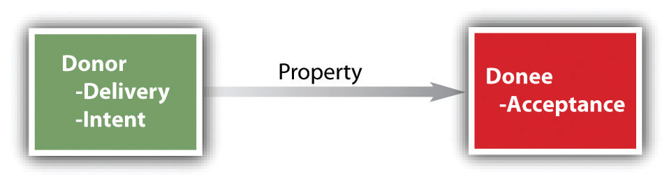

<!-- Overall style -->

<!-- Text color -->
<!--  -->

<!-- Background images -->
<!-- concrete.jpg mountains.jpg trees.jpg roadmap.jpg parrot.jpg-->
<!-- If you use parrots, specify this under body p in the css notes:   width: 750px; -->
<!-- {data-background=trees.jpg data-background-size=cover} -->
<!-- 

Footer text

 -->

## Do these apply to people? {data-background=trees.jpg data-background-size=cover}

- <a href="https://web.archive.org/web/20200318015059/http://www.funnyfidos.com/dog-property-laws/">Dog property laws</a>
- Number 5, 10, and 2 in particular!
- <em>Should</em> they?

## What is property law? {data-background=trees.jpg data-background-size=cover}

Much of what we have studied so far was the legal relationship between people and other people. In contrast, property law concerns the legal relationship between people and <em>things</em>.

## Areas of property {data-background=roadmap.jpg data-background-size=cover}

1. Personal property (this chapter)
2. Intellectual property
3. Real property

## Personal property {data-background=roadmap.jpg data-background-size=cover}

1. Personal property (this chapter)
	+ Real versus personal property
	+ How we aquire property: (a) purchase, (b) possession, (c) finding, (d) gift, (e) accession, and (f) confusion
	+ Fixtures

## Why have property law? {data-background=trees.jpg data-background-size=cover}

To the jurist (someone who studies law), property rights should be protected because it is <em>just to do so</em>. 

To an economist, the legal protection of property rights functions to create incentives to <em>use resources efficiently</em>.

To many others, property rights are deeply embedded in a sense of <em>personhood</em>--ownership of land defines part of who they are.

## What does it mean to own something? {data-background=trees.jpg data-background-size=cover}

- A house?
- A book?
- An ebook?
- A stock?

## The "bundle of rights" theory

## Can you own these? {data-background=trees.jpg data-background-size=cover}

And what does that <em>mean</em>?

- Your voice?
- News?
- The body of a family member?
- Your own genetic material?
- An idea?

## Real versus personal property {data-background=trees.jpg data-background-size=cover}

Real property is immovable, personal property is movable. (Fixtures are somewhat in between.)

## Real versus personal property {data-background=trees.jpg data-background-size=cover}

Real property is immovable, personal property is movable. (Fixtures are somewhat in between.)

Sale of real property = common law, transferred by deed, special taxes; sale of tangible personal property = UCC, transferred without deed, different taxes. 

# How to aquire property rights

## Purchase  {data-background=trees.jpg data-background-size=cover}

The most common method. You buy from someone else, and ownership transfers. Sometimes we have special documents that exchange hands (houses, cars). Also, recall the warranty of title, repossession, etc.

## Possession  {data-background=trees.jpg data-background-size=cover}

Possessing doesn't equal ownership, unless nobody owned it when taken into possession. E.g., hunting.

## Finders keepers?  {data-background=trees.jpg data-background-size=cover}

- Owner can reclaim unless intentionally abandoned
- If owner fails to claim, the finder is the owner (unless found when trespassing, etc)

## Gifts  {data-background=trees.jpg data-background-size=cover}

## Accession  {data-background=trees.jpg data-background-size=cover}

An accession is something that is added to what one already possesses. In general, the rule is that the owner of the thing owns the additional thing that comes to be attached to it. For example, the owner of a cow owns her calves when she gives birth.

## Confusion  {data-background=trees.jpg data-background-size=cover}

Goods of different owners are commingled. A common example is the intermingling of grain in a silo. 

 Assuming that each owner can show how much she has contributed to the confused mass, she is entitled to that quantity, and it does not matter which particular grains or kernels she extracts.

## Practice  {data-background=trees.jpg data-background-size=cover}

Dan captures a wild boar on US Forest Service land. He takes it home and puts it in a cage, but the boar escapes and runs wild for a few days before being caught by Romero, some four miles distant from Dan’s house. Romero wants to keep the boar. Does he “own” it? Or does it belong to Dan, or to someone else?

# Fixtures

## Definition  {data-background=trees.jpg data-background-size=cover}

A fixture is an object that was once personal property that has become so affixed to land or structures that it is legally a part of the real property. For example, a stove bolted to the floor of a kitchen and connected to the gas lines is usually considered a fixture. 

## The big idea  {data-background=trees.jpg data-background-size=cover}

- Treated as real property for tax purposes
- Tests for whether something is a fixture
	+ "Annexed" (affixed) to the real property? (Door affixed to the house)
	+ "Adaptated" to the use of the property? (Home furnace)
	+ "Intention" for which the property was annexed (Why was it installed?)
	
## Practice  {data-background=trees.jpg data-background-size=cover}

Jim and Donna Stoner contract to sell their house in Rochester, Michigan, to Clem and Clara Hovenkamp. Clara thinks that the decorative chandelier in the entryway is lovely and gives the house an immediate appeal. The chandelier was a gift from Donna’s mother, “to enhance the entryway” and provide “a touch of beauty” for Jim and Donna’s house. Clem and Clara assume that the chandelier will stay, and nothing specific is mentioned about the chandelier in the contract for sale. Clem and Clara are shocked when they move in and find the chandelier is gone. Have Jim and Donna breached their contract of sale?

## One last thing {data-background=trees.jpg data-background-size=cover}

What if the police take your personal property? The answer is <a href="http://www.youtube.com/watch?v=3kEpZWGgJks&t=0m33s">complicated</a>.

