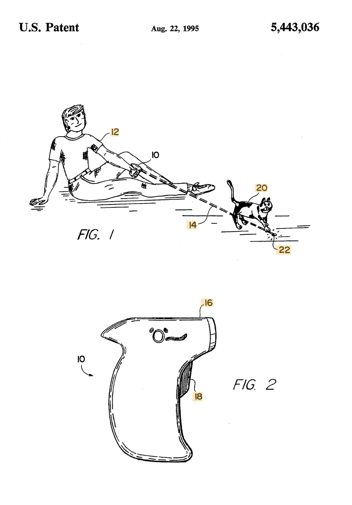

<!-- Overall style -->

<!-- Text color -->

<!-- Background images -->
<!-- concrete.jpg mountains.jpg skyline.jpg roadmap.jpg-->

# {data-background=IP_images/Slide1.jpeg data-background-size=contain}
# {data-background=IP_images/Slide2.jpeg data-background-size=contain}
# {data-background=IP_images/Slide3.jpeg data-background-size=contain}
# {data-background=IP_images/Slide4.jpeg data-background-size=contain}
# {data-background=IP_images/Slide5.jpeg data-background-size=contain}
# {data-background=IP_images/Slide6.jpeg data-background-size=contain}
# {data-background=IP_images/Slide7.jpeg data-background-size=contain}
# {data-background=IP_images/Slide8.jpeg data-background-size=contain}
# {data-background=IP_images/Slide9.jpeg data-background-size=contain}
# {data-background=IP_images/Slide10.jpeg data-background-size=contain}
# {data-background=IP_images/Slide11.jpeg data-background-size=contain}
# {data-background=IP_images/Slide12.jpeg data-background-size=contain}
# {data-background=IP_images/Slide13.jpeg data-background-size=contain}
# {data-background=IP_images/Slide14.jpeg data-background-size=contain}
# {data-background=IP_images/Slide15.jpeg data-background-size=contain}
# {data-background=IP_images/Slide16.jpeg data-background-size=contain}
# {data-background=IP_images/Slide17.jpeg data-background-size=contain}
# {data-background=IP_images/Slide18.jpeg data-background-size=contain}
# {data-background=IP_images/Slide19.jpeg data-background-size=contain}
# {data-background=IP_images/Slide20.jpeg data-background-size=contain}
# {data-background=IP_images/Slide21.jpeg data-background-size=contain}
# {data-background=IP_images/Slide22.jpeg data-background-size=contain}
# {data-background=IP_images/Slide23.jpeg data-background-size=contain}
# {data-background=IP_images/Slide24.jpeg data-background-size=contain}
# {data-background=IP_images/Slide25.jpeg data-background-size=contain}
# {data-background=IP_images/Slide26.jpeg data-background-size=contain}
# {data-background=IP_images/Slide27.jpeg data-background-size=contain}
# {data-background=IP_images/Slide28.jpeg data-background-size=contain}

#
<iframe width="560" height="315" src="https://www.youtube.com/embed/rRi8LptvFZY" frameborder="0" allow="accelerometer; autoplay; encrypted-media; gyroscope; picture-in-picture" allowfullscreen></iframe>

# {data-background=IP_images/Slide30.jpeg data-background-size=contain}
# {data-background=IP_images/Slide31.jpeg data-background-size=contain}
# {data-background=IP_images/Slide32.jpeg data-background-size=contain}
# {data-background=IP_images/Slide33.jpeg data-background-size=contain}
# {data-background=IP_images/Slide34.jpeg data-background-size=contain}

## Novel, useful, and non-obvious?

Method of exercising a cat

## Novel, useful, and non-obvious?

Method of swinging on a swing

In accordance with one embodiment of the present invention, a method is provided for swinging on a swing. The swing comprises a seat for supporting a user that is suspended between two chains that are hung from a substantially horizontal tree branch. The method comprises the steps of: a) positioning a user on the seat; and b) having the user pull alternately on one chain to induce movement of the user and the swing toward one side, and then on the other chain to induce movement of the user and the swing toward the other side, to create side-to-side motion. In another embodiment of the invention, the swinging method may be practiced independently by the user to create the side-to-side motion from an initial dead stop. These and other features of the invention are described in greater detail below.

## Novel, useful, and non-obvious?

Animal toy

# {data-background=IP_images/Slide36.jpeg data-background-size=contain}
# {data-background=IP_images/Slide37.jpeg data-background-size=contain}
# {data-background=IP_images/Slide38.jpeg data-background-size=contain}
# {data-background=IP_images/Slide39.jpeg data-background-size=contain}

#
<iframe width="560" height="315" src="https://www.youtube.com/embed/qPUZo3dQSEM" frameborder="0" allow="accelerometer; autoplay; encrypted-media; gyroscope; picture-in-picture" allowfullscreen></iframe>

# {data-background=IP_images/Slide41.jpeg data-background-size=contain}
# {data-background=IP_images/Slide42.jpeg data-background-size=contain}
# {data-background=IP_images/Slide43.jpeg data-background-size=contain}
# {data-background=IP_images/Slide44.jpeg data-background-size=contain}
# {data-background=IP_images/Slide45.jpeg data-background-size=contain}
# {data-background=IP_images/Slide46.jpeg data-background-size=contain}
# {data-background=IP_images/Slide47.jpeg data-background-size=contain}
# {data-background=IP_images/Slide48.jpeg data-background-size=contain}

## Can you copyright a dance?

Maybe, if it's long enough.

#
<iframe src="https://giphy.com/embed/WmkqburJqXziM" width="480" height="368" frameBorder="0" class="giphy-embed" allowFullScreen></iframe>
<a href="https://giphy.com/gifs/dance-fresh-prince-of-bel-air-carlton-WmkqburJqXziM">Carlton</a>

#
<iframe width="560" height="315" src="https://www.youtube.com/embed/TcWPiHjIExA" frameborder="0" allow="accelerometer; autoplay; encrypted-media; gyroscope; picture-in-picture" allowfullscreen></iframe>

# {data-background=IP_images/Slide50.jpeg data-background-size=contain}
# {data-background=IP_images/Slide51.jpeg data-background-size=contain}
# {data-background=IP_images/Slide52.jpeg data-background-size=contain}

#
<iframe width="560" height="315" src="https://www.youtube.com/embed/N1KfJHFWlhQ" frameborder="0" allow="accelerometer; autoplay; encrypted-media; gyroscope; picture-in-picture" allowfullscreen></iframe>

#
<iframe width="560" height="315" src="https://www.youtube.com/embed/CJn_jC4FNDo" frameborder="0" allow="accelerometer; autoplay; encrypted-media; gyroscope; picture-in-picture" allowfullscreen></iframe>

# {data-background=IP_images/Slide55.jpeg data-background-size=contain}
# {data-background=IP_images/Slide56.jpeg data-background-size=contain}
# {data-background=IP_images/Slide57.jpeg data-background-size=contain}
# {data-background=IP_images/Slide58.jpeg data-background-size=contain}
# {data-background=IP_images/Slide59.jpeg data-background-size=contain}

<!-- 'f' enable fullscreen mode -->

<!-- 'w' toggle widescreen mode -->

<!-- 'o' enable overview mode -->

<!-- 'h' enable code highlight mode -->

<!-- 'p' show presenter notes -->
