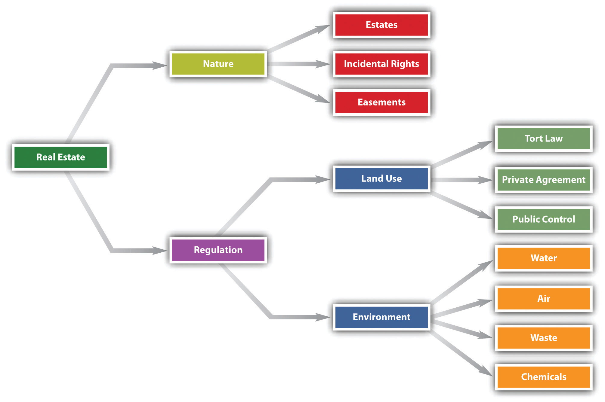
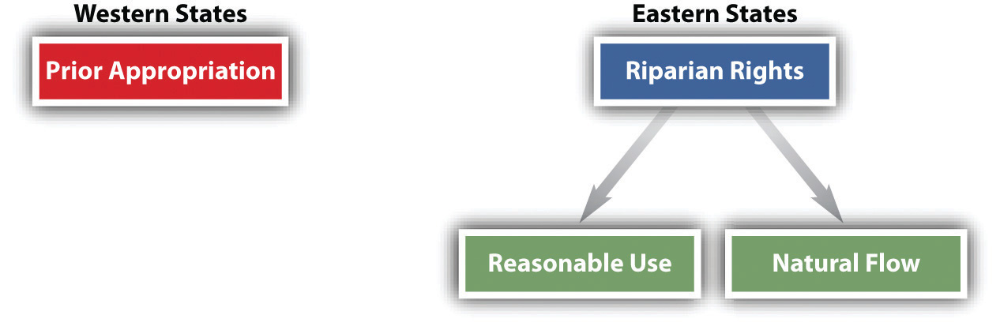

<!-- Overall style -->

<!-- Text color -->

<!-- Background images -->
<!-- {data-background=skyline.jpg data-background-size=cover} -->
<!-- concrete.jpg mountains.jpg mountains2.jpg skyline.jpg roadmap.jpg -->

<!-- 'f' enable fullscreen mode -->
<!-- 'w' toggle widescreen mode -->
<!-- 'o' enable overview mode -->
<!-- 'h' enable code highlight mode -->
<!-- 'p' show presenter notes -->

## Motivation {data-background=mountains2.jpg data-background-size=cover}

Real property law is foundational to business. Some business, like farming, is inherently tied to the land. Many other businesses must own land, offices, retail space, and manufacturing facilities. 

It is crucial to understand the basics of how one owns real property, how others may make use of that property, and how environmental law may restrict what can be done with the property.

##

# Estates {data-background="../section_36/nikola-knezevic-Q3JcLtECTtE-unsplash.jpg" data-background-size=cover}

## Ownership Estates: ways to own property {data-background=mountains2.jpg data-background-size=cover}

- <em>Fee simple absolute:</em> "To Penny." This is what we typically think of when we say someone "owns" land--"complete ownership, immediately and forever, with the right of possession from boundary to boundary and from the center of the earth to the sky"
- <em>Fee simple defeasible:</em> "To Penny, so long as she maintains a physics institute on the land."
- <em>Life estate:</em> "To Penny for life", or "To Penny for the life of Leonard." Tenant cannot act to injure the land! After death, the property reverts back to the transferor.
- You can mix and match: "To Penny for life then to Leonard". (Leaonard's remainder would be a <em>future interest</em> here)
- Leasehold interests are for possession, not ownership. Your apartment lease would be an example.

## Practice {data-background=mountains2.jpg data-background-size=cover}

Jessa owns a house and lot on 9th Avenue. She sells the house to the Hartley family, who wish to have a conveyance from her that says, “to Harriet Hartley for life, remainder to her son, Alexander Sandridge.”  Who has a future interest, and who has a present interest? What is the correct legal term for Harriet’s estate? For Alexander's? 
<!-- Vested remainder interest -->

# Air and water rights {data-background="../section_36/philip-swinburn-uVk9yEp6QlM-unsplash.jpg" data-background-size=cover}

## Air rights {data-background=mountains2.jpg data-background-size=cover}

When you own land, you own (to some degree) the air above, the land beneath, and the water flowing by.

To some degree ....

You can't stop planes from flying over your house (no trespass), but they may constitute a nuisance if the flights are so low and frequent they interfere with enjoyment of the land.

Law for drones is unsettled and complicated!

## Water rights 

## Practice {data-background=mountains2.jpg data-background-size=cover}

Wanda is in charge of acquisitions for her company. Realizing that water is important to company operations, Wanda buys a plant site on a river, and the company builds a plant that uses all of the river water. Downstream owners bring suit to stop the company from using any water. What is the result? Why?

# Regulation and limits on land use {data-background="../section_36/lucas-favre-5B-I62BwJ5E-unsplash.jpg" data-background-size=cover}

## Easements {data-background=mountains2.jpg data-background-size=cover}

- An <em>easement</em> is an interest in land that permits one person to make use of another’s estate
	+ E.g., permission to fish in my pond
- These can be affirmative (right to fish in my pond) or negative (I can't block light for your solar panels)
- These can be created expressly (e.g., you buy the right to fish in my pond) 
- They can also be created by operation of law. A <em>prescriptive easement</em> occurs when property is used without permission for a long enough period. 

## Adverse possession {data-background=mountains2.jpg data-background-size=cover}

- If one party continuously, openly, and notoriously uses another's property for long enough (e.g., 20 years), they can claim title to the land
- This is called <em>adverse possession</em> or informally "squatter's rights"
- Provides incentive to use and monitor land

## Tort law {data-background=mountains2.jpg data-background-size=cover}

- <em>Nuisance:</em> interference with the use and enjoyment of one’s land.
- <em>Trespass:</em> wrongful physical invasion of or entry upon land possessed by another. 
	+ Note: just because someone's trespassing doesn't mean they aren't owed legal duties, such as to warn known trespassers of hazards
	+ Be careful of creating an "attractive nuisance"

## Practice {data-background=mountains2.jpg data-background-size=cover}

Dennis likes to spend his weekends in his backyard, shooting his rifle across his neighbor’s yard. If Dennis never sets foot on his neighbor’s property, and if the bullets strike neither persons nor property, has he violated the legal rights of the neighbor? Explain.

## Covenants {data-background=mountains2.jpg data-background-size=cover}

- A restrictive covenant is an agreement regarding the use of land that “runs with the land.” In effect, it is a contractual promise that becomes part of the property and that binds future owners. 
- May be changed due to changing circumstances in neighborhood
- Cannot be racially discriminatory! Shelley v. Kraemer, 334 U.S. 1 (1947).

## Eminent domain {data-background=mountains2.jpg data-background-size=cover}

- Government may seize land for public use
- Governments must pay "just compensation"
- This is a <em>very broad</em> concept. See Kelo v. New London, 545 U.S. 469 (2005).
- What if government regulation diminishes the value of property rather than outright seizing?

## Zoning {data-background=mountains2.jpg data-background-size=cover}

- Zoning is a technique by which a city or other municipality regulates the type of activity to be permitted in geographical areas within its boundaries. Though originally limited to residential, commercial, and industrial uses, today’s zoning ordinances are complex sets of regulations. 

- A typical municipality might have the following zones: 
	+ residential with a host of subcategories (such as for single-family and multiple-family dwellings)
	+ office 
	+ commercial 
	+ industrial
	+ agricultural
	+ public lands.

## Practice {data-background=mountains2.jpg data-background-size=cover}

Jamie Stoner decides to put solar panels on the south face of his roof. Jamie lives on a block of one- and two-bedroom bungalows in South Miami, Florida. In 2009, someone purchases the house next door and within two years decides to add a second and third story. This proposed addition will significantly decrease the utility of Jamie’s solar array. Does Jamie have any rights that would limit what his new neighbors can do on their own land?

<!-- This takes a little research for "solar access" laws -->
<!-- See also "right to light" and "air rights" in NYC. Regulation steps in as no great common law solutions exist-->

# Environmental law  {data-background="../section_36/qingbao-meng-01_igFr7hd4-unsplash.jpg" data-background-size=cover}

## Water {data-background=mountains2.jpg data-background-size=cover}

- Clean Water Act of 1972
- Regulates discharge into waters
- Applies (under Commerce Clause) to "waters of the United States"
	+ This has been the source of great controversy, from the "prarie pothole rule" to the "migratory bird rule"
	+ Different administrations may modify its extent. Current rule is the "significant nexus" rule.
		* Wetlands count, and other waters that have a significant nexus to navigable water
	 
## Air {data-background=mountains2.jpg data-background-size=cover}

- Price of industrialization in the United States was often hazardous air quality 
- Clean Air Act of 1970 limits pollution that affects human health, animal, plants, and property
- States implement standards EPA establishes
- EPA regulates both fixed and mobile sources of emissions

## CERCLA {data-background=mountains2.jpg data-background-size=cover}

Comprehensive Environmental Response, Compensation, and Liability Act (Superfund) 

- Imposes harsh liability rules for hazardous waste, against even current owners
- "Innocent landowner" defense can apply if presence of hazardous waste was investigated before purchase

## Chemical hazards {data-background=mountains2.jpg data-background-size=cover}

Toxic Substances Control Act controls the manufacture, processing, commercial distribution, use, and disposal of chemicals that pose unreasonable health or environmental risks.

Industry groups <em>and</em> consumer groups have attacked the TSCA. Industry groups criticize the act because the enforcement mechanism requires mountainous paperwork and leads to widespread delay. Consumer groups complain because the EPA has been slow to act against numerous chemical substances. 

## A case study {data-background=mountains2.jpg data-background-size=cover}

- This will let us review administrative law!
- <a href="https://supreme.justia.com/cases/federal/us/556/208/">Energy Corp. v. Riverkeeper</a>
- Does best mean <em>best</em>?

## Final tidbits {data-background=mountains2.jpg data-background-size=cover}

What happens when land <em>moves</em>?

Land on the moon?

Castle doctrine?

