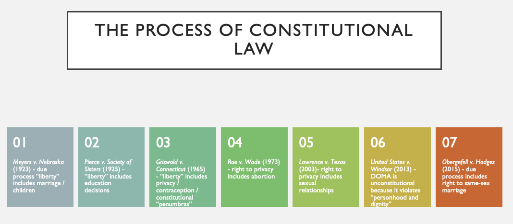
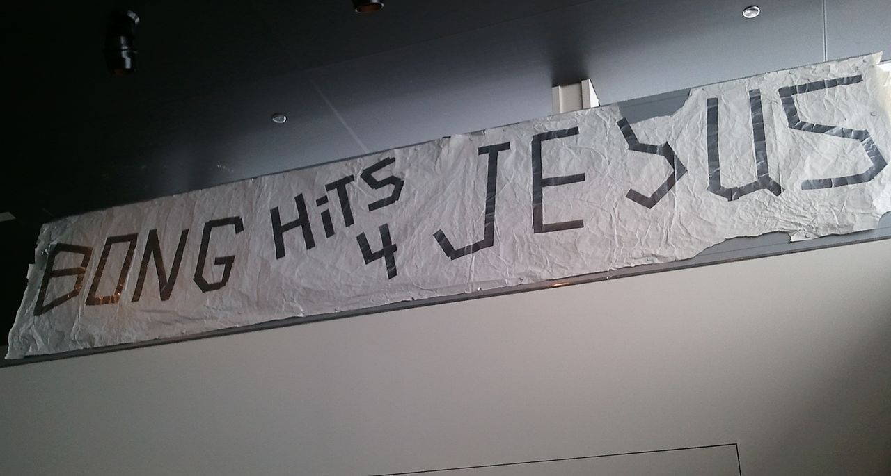
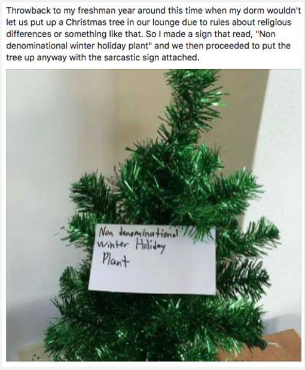
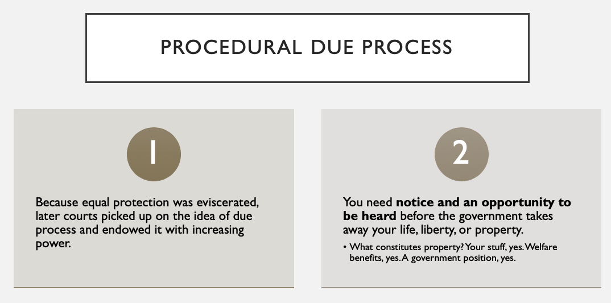
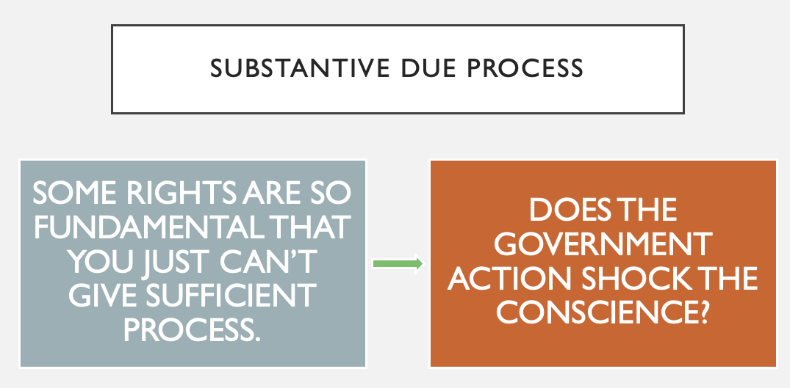

# Text and Structure of <a href="https://www.constituteproject.org/constitution/United_States_of_America_1992">the Constitution</a>

## 

## The Commerce Clause: <a href="../s07-06-cases.html">Wickard v. Filburn</a> 

## The Dormant Commerce Clause:    <a href="../s07-06-cases.html">Wickard v. Filburn</a> {data-background=background_white_flower.jpg data-background-size=cover}

## Preemption {data-background=background_white_flower.jpg data-background-size=cover}
- Express: <a href="https://www.accessdata.fda.gov/scripts/cdrh/cfdocs/cfcfr/CFRSearch.cfm?fr=101.30">100% Juice</a>
- Implied: <a href="https://www.supremecourt.gov/opinions/11pdf/11-182b5e1.pdf"><em>Arizona v. United States</em></a>

 

## Practice {data-background=background_white_flower.jpg data-background-size=cover}

For many years, the United States engaged in discussions with friendly nations as to the reciprocal use of ports and harbors. These discussions led to various multilateral agreements between the nations as to the configuration of oceangoing vessels and how they would be piloted. At the same time, concern over oil spills in Puget Sound led the state of Washington to impose fairly strict standards on oil tankers and requirements for the training of oil tanker pilots. In addition, Washington’s state law imposed many other requirements that went above and beyond agreed-upon requirements in the international agreements negotiated by the federal government. Are the Washington state requirements preempted by federal law?

## First Amendment: speech {data-background=background_white_flower.jpg data-background-size=cover}

Congress shall make no law respecting an establishment of religion, or prohibiting the free exercise thereof; or **abridging the freedom of speech**, or of the press; or the right of the people peaceably to assemble, and to petition the Government for a redress of grievances.

- Content Neutral
    - Constitutional if it advances an **important** government interest, is narrowly tailored, and not aimed at suppressing ideas.
- Content Specific
    - Constitutional if it advances a **compelling** government interest, is narrowly tailored, and not aimed at suppressing ideas.
- Commercial
    - Constitutional if it directly advances a **substantial** government interest, and goes no further than is necessary.

## General exceptions {data-background=background_white_flower.jpg data-background-size=cover}
- Fighting words
- Defamation
- Obscenity
- Congress

## Practice {data-background=background_white_flower.jpg data-background-size=cover}

A recent Indiana statute prohibits most registered sex offenders from using social networking websites, instant messaging services, and chat programs. John Doe, on behalf of a class of similarly situated sex offenders, challenges this law on First Amendment grounds. 

- <a href="https://caselaw.findlaw.com/us-7th-circuit/1621340.html">Doe v. Prosecutor Marion County</a>

## Practice {data-background=background_white_flower.jpg data-background-size=cover}

A recent Indiana statute prohibits most registered sex offenders from using social networking websites, instant messaging services, and chat programs. John Doe, on behalf of a class of similarly situated sex offenders, challenges this law on First Amendment grounds. We reverse the district court and hold that the law as drafted is unconstitutional. Though content neutral, we conclude that the Indiana law is not narrowly tailored to serve the state's interest. It broadly prohibits substantial protected speech rather than specifically targeting the evil of improper communications to minors.

- <a href="https://caselaw.findlaw.com/us-7th-circuit/1621340.html">Doe v. Prosecutor Marion County</a>

## Practice {data-background=background_white_flower.jpg data-background-size=cover}

- Black armbands protesting Vietnam at school?
- Sexual content in speech at high school?
- Teen pregnancy article in student newspaper?
- Ban on door knocking without a permit?
- Law requiring calorie disclosure at restaurants?
- Burning a flag?

## <a href="https://web.archive.org/web/20200206220520/http://www.nbcnews.com/id/17648725/ns/us_news-life/t/bong-hits-jesus-case-heads-high-court/">Practice</a> {data-background=background_white_flower.jpg data-background-size=cover}

# <a href="https://www.law.cornell.edu/uscode/text/4/8">Why then ...</a> {data-background=background_white_flower.jpg data-background-size=cover}

## First Amendment: religion {data-background=background_white_flower.jpg data-background-size=cover}

Congress shall make no law **respecting an establishment of religion, or prohibiting the free exercise thereof**; or abridging the freedom of speech, or of the press; or the right of the people peaceably to assemble, and to petition the Government for a redress of grievances.

- State can’t endorse a religion. The particulars get tricky. 
- Government can’t unreasonably restrict religion. Again, this gets tricky.
    - Refuse to bake a wedding cake for a gay marriage?
- Federal employment law prohibits workplace discrimination on the basis of religion
    - Can Abercrombie & Fitch <a href="https://www.npr.org/sections/thetwo-way/2015/06/01/411213623/supreme-court-rules-for-woman-denied-abercrombie-fitch-job-over-headscarf">deny you a job</a> because of a headscarf?

## What if the establishment clause and free exercise clause contradict? {data-background=background_white_flower.jpg data-background-size=cover}

 

# The Fourteenth Amendment

## 

## 

## Fourteenth Amendment Analysis {data-background=background_white_flower.jpg data-background-size=cover}
- **Minimal scrutiny** (rational basis review): economic and social relations. Government actions are usually upheld if there is a rational basis for them.
- **Intermediate scrutiny**: gender. Government classifications are sometimes upheld.
- **Strict scrutiny**: race, ethnicity, and fundamental rights. Classifications based on any of these are almost never upheld.

<em>But see</em> Obergefell v. Hodges (finding violation of both substantive due process and equal protection, without identifying the level of scrutiny)

## For example: <a href="https://caselaw.findlaw.com/us-8th-circuit/1653028.html">Taxis in Kansas City</a>

<!-- 'f' enable fullscreen mode -->

<!-- 'w' toggle widescreen mode -->

<!-- 'o' enable overview mode -->

<!-- 'h' enable code highlight mode -->

<!-- 'p' show presenter notes -->
