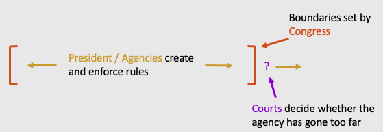
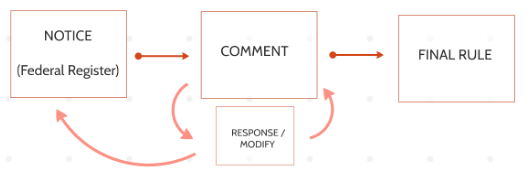
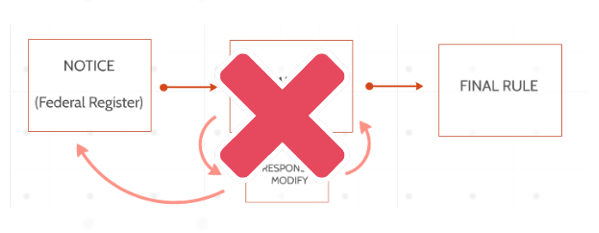

## Introduction {data-background=mountains.jpg data-background-size=cover}

- "Administrative law" is the study of government agencies: how they make regulations ("rules"), how they enforce those rules, the role courts play in interpreting those rules and actions, and so on
- We will focus on federal administrative law, though state laws and structure are often similar

## Introduction {data-background=mountains.jpg data-background-size=cover}
- There are hundreds of federal agencies listed in the Federal Register: <a href="https://www.federalregister.gov/agencies">https://www.federalregister.gov/agencies</a> 
- These deal with every aspect of business activity, and publish thousands of new rules each year
- Rather than studying each agency and rule, we will examine the <em>process</em> of administrative rulemaking and adjudication
- And then study some particular substantive areas (such as environmental law) later in class

## For example .... {data-background=mountains.jpg data-background-size=cover}

Consider public land. The federal government has "fee simple" title to about 30% of land in the United States. (62% of Idaho and 80% of Nevada!) This land is administered by a variety of agencies, including:

- Department of the Interior
	+ Bureau of Land Management (BLM)
	+ Fish and Wildlife Service (FWS)
	+ National Park Service (NPS)
- Department of Agriculture
	+ Forest Service (FS)
- Department of Defense (bases)

## For example .... {data-background=mountains.jpg data-background-size=cover}

Some of this land is protected for conservation (National Parks, National Wildlife Refuge System land managed by the FWS, National Forest System managed by the FS). Some is used by the public more loosely (grazing land managed by the BLM). 

National trails and other special lands have special designations within those lands ....

## For example .... {data-background=mountains.jpg data-background-size=cover}

Other land is managed by the U.S. Army Corps of Engineers, Bureau of Reclamation (water infrastructure in the west), Post Office, NASA, and Department of Energey. Even counting all this land is <a href="https://www.dropbox.com/s/holnjokkiofj2hl/R42346.pdf?dl=0">hard</a>.

# Confused? It's okay.

## Agencies and the Branches of Government {data-background=mountains.jpg data-background-size=cover}
- Congress (Art. I) creates agencies, and delegates lawmaking power to them
	+ Congress can always overrule a regulation via statute!
- The President (Art. II) appoints leadership and directs agencies within the boundaries set by Congress
- Courts (Art. III) decide if the agency has exceeded its delegated powers and review agency action (once administrative review is "exhausted")
 

#  

 <iframe width="560" height="315" src="https://www.youtube.com/embed/JUDSeb2zHQ0" frameborder="0" allow="accelerometer; autoplay; encrypted-media; gyroscope; picture-in-picture" allowfullscreen></iframe>

 

## Rulemaking {data-background=mountains.jpg data-background-size=cover}

For an example in practice, see <a href="https://en.wikipedia.org/wiki/Net_Neutrality_(Last_Week_Tonight)">John Oliver's take</a> on the FCC's proposed net neutrality rules

# Examine recent activity in the Federal Register. What do you find?

## Practice {data-background=mountains.jpg data-background-size=cover}
 1. Explain why Congress needs to delegate rule-making authority to a specialized agency.
 2. Explain why there is any need for interference in the market by means of laws or regulations.
 3. If there <em>is</em> a need in the market for laws or regulations, why not let courts handle everything (instead of creating agencies)?

## Practice {data-background=mountains.jpg data-background-size=cover}

1. Find the website of the Consumer Product Safety Commission (CPSC). Identify from that site a product that has been banned by the CPSC for sale in the United States. What reasons were given for its exclusion from the US market?
2. What has Congress told the CPSC to do in its enabling act? Is this a clear enough mandate to guide the agency? What could Congress do if the CPSC does something that may be outside of the scope of its powers? What can an affected business do?

## Reality (often) {data-background=mountains.jpg data-background-size=cover}

 - Informal agency action
 	+ Guidance documents
 	+ Warning letters
 	+ Courts may treat as highly persuasive!
 	+ <a href="https://news.bloomberglaw.com/daily-labor-report/trump-orders-to-limit-effect-of-agency-guidance-to-industry">But see ...</a>

## Back to our land example ... {data-background=mountains.jpg data-background-size=cover}

Congress has left much federal land management law up to agencies. This means that the laws pertaining to public land can change dramatically based on the party in power. The law can shift towards conservation or commodification easily, without act of Congress. 

(Congress could, of course, overrule agency action through statute, but this would be rare.)

## The APA (Administrative Procedure Act) {data-background=mountains.jpg data-background-size=cover}

- Provides a set of default rules for agency action
- For example, the APA says to publish notice of rulemaking in the Federal Register
- Creates Administrative Law Judges (ALJ's) who preside over adjudications (court-like proceedings)
	+ These are not Article III judges with life tenure, but increasingly act as such
- Agency action cannot be "arbitrary and capricious"

## Chevron Deference {data-background=mountains.jpg data-background-size=cover}

- If Congress did not speak clearly to an issue, courts must defer to the agency's "permissible" or "reasonable" interpretation of the statute.
- Applies to formal rulemaking or adjudication, not to informal agency action
- Not all Supreme Court justices like this, so its days may be numbered
	+ <em>Chevron</em> deference gives judicial power to the executive branch

## The Administrative Burden on Business ... 

... is enormous. 

  

- Inspections
	+ Generally need a warrant, except for highly regulated industries like liquor or junkyards
- Paperwork
- Regulatory compliance for product standards
- We will return to this theme under consumer law 

## Judicial Review of Agency Action {data-background=mountains.jpg data-background-size=cover}

Before you can complain to court about an agency’s action, you must first try to get the agency to reconsider its action. Generally, you must have asked for a hearing at the hearing examiner level, there must have been a decision reached that was unfavorable to you, and you must have appealed the decision to the full board.

For an example from land use, see <a href="https://www.oyez.org/cases/2011/10-1062">Sackett v. EPA</a>. What do you learn about exhausting agency action? What other doctrines does this case illustrate?

## Practice {data-background=mountains.jpg data-background-size=cover}

Together, look at <em>Marshall v. Barlow’s, Inc.</em> under <a href="../s08-06-cases.html">Cases</a>, and try to answer the discussion questions.

<!-- 'f' enable fullscreen mode -->

<!-- 'w' toggle widescreen mode -->

<!-- 'o' enable overview mode -->

<!-- 'h' enable code highlight mode -->

<!-- 'p' show presenter notes -->
