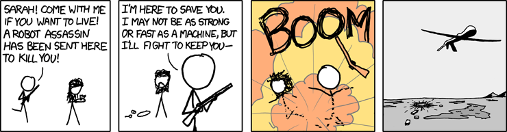

<!-- Overall style -->

<!-- Text color -->

<!-- Background images -->
<!-- concrete.jpg mountains.jpg skyline.jpg roadmap.jpg parrot.jpg-->
<!-- If you use parrots, specify this under body p in the css notes:   width: 750px; -->
<!-- {data-background=skyline.jpg data-background-size=cover} -->
<!-- 

Footer text

 -->

## Sources of law {data-background=parrot.jpg data-background-size=cover}

There are two main sources of United States contract law:

1. The common law
2. A statute called the Uniform Commercial Code (UCC)

The <em>common law</em> applies to real estate and services (e.g., painting a house, selling a farm). The <em>UCC</em> applies to sale of movable, tangible goods (a book, a fridge, a book about fridges, etc). We will mostly study the common law, but we will at times mention the UCC for special cases.

## The big idea {data-background=parrot.jpg data-background-size=cover}

<em>A contract is a legally enforceable promise.</em>

It is based on <em>voluntary</em> obligations, whereas tort law was <em>involuntary</em>. Together, contract and tort are the foundations of the common law of business practice.

##   Roadmap {data-background=roadmap.jpg data-background-size=cover}

<ol style="color:#1C2833"> 
<li>How do you make a contract?</li>
<li>How might you get out of a contract?</li>
<li>How do you interpret contracts?</li>
<li>What are the remedies for broken contracts?</li>
</ol>

# 1. How do you make a contract?

##   How do you make a contract? {data-background=roadmap.jpg data-background-size=cover}

<ol style="color:#1C2833"> 
<li>Offer</li>
<li>Acceptance</li>
<li>Consideration</li>
<li>Capacity</li>
</ol>

You do <em>not</em> need a writing, except in a few special cases!

# 
<iframe width="560" height="315" src="https://www.youtube.com/embed/FqCsA6LV3dA" frameborder="0" allow="accelerometer; autoplay; encrypted-media; gyroscope; picture-in-picture" allowfullscreen></iframe>

## The offer {data-background=parrot.jpg data-background-size=cover}

- An offer is <em>manifestation of willingness to enter into a bargain</em> such that it would be reasonable for another individual to conclude that assent to the offer would complete the bargain.

- To accomplish this, it should be:
	+ Serious
	+ Communicated

#
<iframe width="560" height="315" src="https://www.youtube.com/embed/U_n5SNrMaL8" frameborder="0" allow="accelerometer; autoplay; encrypted-media; gyroscope; picture-in-picture" allowfullscreen></iframe>

# <a href="https://jlingwall.github.io/LegalEnvironment/s56-05-cases.html">Lucy v. Zehmer</a> 

# <a href="https://web.archive.org/web/20180310113238/http://caselaw.findlaw.com/pa-superior-court/1723746.html">Hinkal v. Pardoe</a>

## Not offers {data-background=parrot.jpg data-background-size=cover}

- <em>Opinions</em>
- <em>Advertisements</em>
	+ Generally advertisements are invitations to come make a deal, not offers.
	+ This could change if the advertisement induces action, such as "first come first served"

## Ending an offer {data-background=parrot.jpg data-background-size=cover}

- An offer may end by action of the <em>offeror</em>
	+ Revoking the offer
	+ Unless irrevocable, like an option contract
- It may also end by the <em>offeree</em>
	+ Rejecting
	+ Counteroffers
- And by operation of <em>law</em>
	+ The contract becomes illegal
	+ Excessive time has passed

## Acceptance {data-background=parrot.jpg data-background-size=cover}

- Offeror can control manner
	+ If I want skywriting, I get skywriting
	+ Otherwise any reasonable manner is fine
- <em>"Mirror image rule"</em> (common law) versus <em>"battle of the forms"</em> (UCC)

## Consideration {data-background=parrot.jpg data-background-size=cover}

- Offer and acceptance alone is insufficient to be enforceable
	+  E.g. “I promise to give you $100” responded with “yes!” is not a contract
-  There must be a <em>bargained-for exchange</em>, or “consideration”, from both sides
	+ “I promise to sell you this book for $100” responded with “yes!”

## Consideration {data-background=parrot.jpg data-background-size=cover}

Consideration exists when the party suffers a <em>legal detriment</em>: giving up a legal right or benefit

- Promise <em>to do</em> something you need not do
- Promise <em>not to do</em> something you may legally do

## Consideration {data-background=parrot.jpg data-background-size=cover}

Simplest possible case: <em>sales</em>

## Consideration {data-background=parrot.jpg data-background-size=cover}

Is doing something good for you consideration? 

<em>Hamer v. Sidway</em>

## Consideration {data-background=parrot.jpg data-background-size=cover}

 <em>Courts don’t question fairness of bargains</em> by examining the adequacy of consideration. A “peppercorn” is enough.

We police unfair bargains with the doctrines of fraud and unconscionability, not lack of consideration

For example, woefully inadequate consideration can be evidence of fraud, but you sue for fraud, not to rescind the contract for lack of consideration

## Consideration {data-background=parrot.jpg data-background-size=cover}

Some final thoughts:

1. A <em>gift with "uptake"</em> is not consideration. “I promise to give you a million dollars, you just need to come pick it up from my house,” is not an offer.
2. Be careful of <em>pre-existing duties</em>
3. Be careful of <em>foreseen difficulties</em>

## Capacity {data-background=parrot.jpg data-background-size=cover}

“Capacity” means the legal ability to enter into a contract

Common problems ….

- <em>Minors</em>
	+ May disaffirm!
	+ In some states, the minor need not even return the consideration
	+ Exceptions for necessities, believably lie about their age, etc
- <em>Extreme intoxication</em>
	+ Don’t let friends drink and make contracts!
- <em>Mental incompetence</em>
	+ Void if previously declared incompetent, otherwise voidable

## Capacity {data-background=parrot.jpg data-background-size=cover}

Capacity to contract?

## Does it need to be in writing?  {data-background=parrot.jpg data-background-size=cover}

<em>Statute of Frauds:</em>

1. Contracts to convey an interest in <em>land</em> (such as sale of a home);
2. Contracts that are <em>impossible to fulfill within one year</em> (such as a contract entered July 1, for employment beginning August 1 and lasting a year);
3. Contracts in which the consideration is <em>marriage</em>;
4. Contracts to <em>pay another's debt</em>; and
5. Under the UCC, contracts for <em>sale of goods for at least $500</em> (and lease of goods of at least $1,000).

# <a href="https://www.dropbox.com/s/gbh9wbaaqy181s4/Contract%20Law%20Discussion%20Question-%20Football.pdf?dl=0">Practice</a> 

# 2. How might you get out of a contract? 

##  How to get out of a contract {data-background=roadmap.jpg data-background-size=cover}

<ol style="color:#1C2833"> 
<li>Fraud</li>
<li>Mistake</li>
<li>Duress and undue influence</li>
<li>Illegality, including unconscionability</li>
</ol>

## Fraud {data-background=parrot.jpg data-background-size=cover}

- The tort of fraud gets you out of a contract
- And opens the door to punitive damages!

#
<iframe width="560" height="315" src="https://www.youtube.com/embed/3PsUJFEBC74" frameborder="0" allow="accelerometer; autoplay; encrypted-media; gyroscope; picture-in-picture" allowfullscreen></iframe>

## Mistake {data-background=parrot.jpg data-background-size=cover}

- Unilateral mistake = tough luck
	+ Contract exists because people value things differently!
- Mutual mistake of fact = contract voidable
	+ Consider the <em>Peerless</em>

## Duress and undue influence {data-background=parrot.jpg data-background-size=cover}

- <em>Duress</em>
	+ Threats make a contract voidable if they prevented someone of ordinary resolve from exercising free will
	+ Death threat = voidable
	+ Threat to sue frivolously = no duress (just defend the lawsuit)
- <em>Undue influence</em>
	+ A special relationship overcomes free will. E.g., convincing an elderly relative to sell you their home at below market-value

## Illegality {data-background=parrot.jpg data-background-size=cover}

Contracts to commit crimes are <em>void</em>.

So contrary to movies, there are no "contract killers."

<small>https://xkcd.com/652/</small>

## Unconscionability {data-background=parrot.jpg data-background-size=cover}

Contracts may also be illegal because courts choose not to enforce them as a matter of public policy, if they shock the conscience.

- These are usually evaluated for procedural and substantive unconscionability
- <em>Procedural unconscionability</em> refers to the form of the contract
	+ E.g., Tiny print, super-long, ink that makes you sick
- <em>Substantive unconscionability</em> refers to the terms of the contract
	+ Shockingly unfair or oppressive
	+ E.g., arbitration clauses in small consumer contracts
- These are like the bacon bits of contract law ....

# 3. How do you interpret contracts?

## Interpreting contracts  {data-background=parrot.jpg data-background-size=cover}

- <em>Ambiguous terms?</em>
	+ E.g. , insurance policy that covers “seeps” but not “leaks”?
	+ You can bring in external evidence
	+ Or, construe it against the person who drafted it!
- <em>“Merger” or “integration” clauses</em>
	+ These are often added to contracts to show that the written document is the entire agreement
- <em>“Parole evidence” rule</em>
	+ If a contract is integrated, whether through a merger clause or otherwise, no evidence of prior oral agreements can contradict or supplement the written document	

## <a href="https://www.dropbox.com/s/jzz4d3qskalt7h9/GROVE%20v.%20CHARBONNEAU%20BUICK-%20PONTIAC%2C%20INC..pdf?dl=0">Grove v. Charbonneau Buick Pontiac</a>  {data-background=parrot.jpg data-background-size=cover}

# <a href="https://www.dropbox.com/s/767343jsfe5up6s/Contract%20law%20discussion%20question.pdf?dl=0">Practice</a>

# 4. What are the remedies for broken contracts?

## Contract remedies in a nutshell {data-background=parrot.jpg data-background-size=cover}

- <em>Waive the breach</em>
	+ Often the preferred remedy. Just let it go.
- <em>Seek expectation damages</em>
	+ Put you in the same position as if the contract had been fulfilled
	+ E.g., if A contracts to sell B a parrot for $100, and then A breaches, if B finds a parrot from an alternative source for $150, the damages are $50. This puts B in the same position as if A had fulfilled the contract.
	+ May be unavailable if they can't be calculated with reasonable certainty, such as a new business

## Contract remedies in a nutshell {data-background=parrot.jpg data-background-size=cover}

- <em>Specific performance</em>
	+ If money cannot put you in the same position as if the contract had been fulfilled (e.g., sculpture, art, land) it’s possible that a court might order you to do as you promised.
	+ This is rare. Courts vastly prefer to award damages rather than require specific performance.

## Duty to mitigate {data-background=parrot.jpg data-background-size=cover}

- If someone breaks a contract with you, the law imposes a <em>duty to mitigate</em>
	+ One cannot simply let damages accrue and then sue
	+ In a rental agreement, if someone breaks a lease, the landlord has a duty to attempt to find someone to take over the lease, rather than letting the apartment set empty

## Liquidated damages {data-background=parrot.jpg data-background-size=cover}

- You can specify what the damages will be <em>in the contract!</em>
- These are enforceable, so long as they are reasonable.
	+ E.g., no million dollar liquidated damages clauses for sale of a parrot, as that would essentially be creating specific performance.

