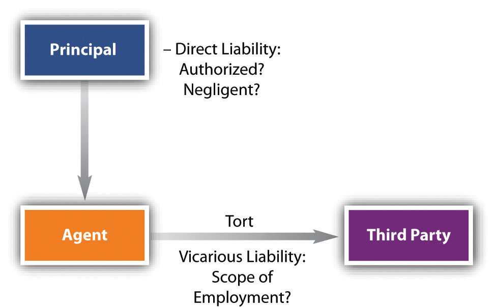

<!-- Overall style -->

<!-- Text color -->

<!-- Background images -->
<!-- {data-background=skyline.jpg data-background-size=cover} -->
<!-- concrete.jpg mountains.jpg mountains2.jpg skyline.jpg roadmap.jpg -->

<!-- Good section headers with white text
sander-weeteling-4LiyQSlYD-4-unsplash.jpg -->
<!-- cristiane-teston-2iV9nqP4Y6A-unsplash.jpg -->
<!-- christopher-burns-QaGNhezu_5Q-unsplash.jpg -->

<!-- 'f' enable fullscreen mode -->
<!-- 'w' toggle widescreen mode -->
<!-- 'o' enable overview mode -->
<!-- 'h' enable code highlight mode -->
<!-- 'p' show presenter notes -->

## Motivation {data-background=mountains2.jpg data-background-size=cover}

Few people can run an entire business of consequence by themselves. An artificial entity like a corporation can <em>only</em> act through natural people tasked with responsibilities. For these reasons, we need to study what the law has to say when people act for others. This is the law of <em>agency</em>.

## What is "agency"? {data-background=mountains2.jpg data-background-size=cover}

An <em>agent</em> is a person who acts in the name of and on behalf of another (the <em>principal</em>), having been given and assumed some degree of authority to do so. Most organized human activity—and virtually all commercial activity—is carried on through agency.

# {data-background=../section_41/e89c3ecb4f0a749c64a99a8c1085687c.jpg data-background-size=contain}

## Types of agents {data-background=mountains2.jpg data-background-size=cover}

- <em>General agent</em>: the authority to carry out a broad range of transactions in the name and on behalf of the principal (see "general power of attorney")
- <em>Special agent</em>: has authority to act in specific instance
- <em>Agency with an interest</em>: when payment of the agent depends on continuing to have authority, such as a talent agent who collects a portion of revenue
- <em>Servant/Employee</em>: an old legal term for what we would call an employee--an agent whose physical conduct is subject to control by the principal
- <em>Independent contractor</em>: performs a task for another not subject to control of their physical conduct

# {data-background=Contractors.jpg data-background-size=cover}

## Tests for employee / independent contractor  {data-background=mountains2.jpg data-background-size=cover}

- This can depend on the state, and this law is very much in flux as the "gig economy" transforms the workplace. Traditionally these include:
	+ Whether the manner of work is controlled
	+ Degree of business integration
	+ Continuity of relationship
	+ Flexibility of schedule
	+ Ownership of tools
	+ Method of payment

# How to create an agency relationship {data-background=christopher-burns-QaGNhezu_5Q-unsplash.jpg data-background-size=cover}

## Express authority {data-background=mountains2.jpg data-background-size=cover}

- This is an agency created by <em>agreement</em>
- These may, or may not be, contractual
	+ They can be created without consideration!
- Special cases need to be in writing
	+ If the agency will last more than a year
	+ In many places, if the agent will deal in real estate
	+ Etc

## Implied authority {data-background=mountains2.jpg data-background-size=cover}

This term is used in two senses:

- In some cases, agency can be created by operation of law. E.g., a child purchases a necessity on parent's account
- It can also refer to the non-express authority needed to carry out an action granted under express authority
	+ E.g., a manager may have implied authority to purchase inventory even if not expressly spelled out

## Apparent authority {data-background=mountains2.jpg data-background-size=cover}

Apparent authority is created when the principal creates the <em>appearance</em> of authority in the view of a third party. 

Suppose Arthur is Paul’s agent, employed through October 31. On November 1, Arthur buys materials at Lumber Yard—as he has been doing since early spring—and charges them to Paul’s account. Lumber Yard, not knowing that Arthur’s employment terminated the day before, bills Paul. Will Paul have to pay? Yes, because the termination of the agency was not communicated to Lumber Yard. It <em>appeared</em> that Arthur was an authorized agent. (Paul must pay the bill, but will have a cause of action against Arthur!)

# {data-background=../section_42/16979103e83f05946956121f70dac774.jpg data-background-size=cover}

## Practice {data-background=mountains2.jpg data-background-size=cover}

What is the rationale for the doctrine of apparent authority—that is, why would the law impose a contract on a “principal” when in fact there was no principal-agent relationship with the “agent” at all?

# Duties of principals and agents  {data-background=sander-weeteling-4LiyQSlYD-4-unsplash.jpg data-background-size=cover}

## Duties of agents {data-background=mountains2.jpg data-background-size=cover}

- <em>"Fiduciary duty"</em>: Agency imposes a higher duty than simply to abide by the contract terms. Their responsibility is to subordinate their self-interest to that of their principal.
	+ No self dealing
	+ Duty of skill and care
	+ Duty of lawful obedience 

## Duties of principals {data-background=mountains2.jpg data-background-size=cover}

- Principals do <em>not</em> owe agents fiduciary duties
- They do owe a different set of duties:
	+ Duty to indemnify / reimburse
	+ Duty to warn of harm
	+ If the agent is an employee, provide workers' compensation

## Practice {data-background=mountains2.jpg data-background-size=cover}

Upon graduation from college, Edison was hired by a major chemical company. During the time when he was employed by the company, Edison discovered a synthetic oil that could be manufactured at a very low cost. What rights, if any, does Edison’s employer have to the discovery? Why?

## Workers' compensation {data-background=mountains2.jpg data-background-size=cover}

- A no-fault system of compensation for accidental injury at work
- Applies to employees, not independent contractors
- Differ by state
- Provide 100% of cost of medical care and some lost wages and benefits
- These can be very specific
	+ E.g., 60 weeks for lost thumb, 37 weeks for lost index finger, 20 weeks for lost third finger, 15 weeks for lost little finger
	+ 30 weeks for great toe, 10 weeks for other toes

## Practice {data-background=mountains2.jpg data-background-size=cover}

Judge Learned Hand, a famous early-twentieth-century jurist (1872–1961), said, “The fiduciary duty is not the ordinary morals of the marketplace.” How does the fiduciary duty differ from “the ordinary morals of the marketplace”? Why does the law impose a fiduciary duty on the agent?

# Liability of principals and agents {data-background=cristiane-teston-2iV9nqP4Y6A-unsplash.jpg data-background-size=cover}

## Liability in contract {data-background=mountains2.jpg data-background-size=cover}

If the agent acted with authority (including apparent authority) the principal will be bound. But note: if the principal was undisclosed, the agent will be be the one that gets sued!

This is why individuals operating as agents are typically very careful to sign documents as, e.g., "John Doe, Agent of BigCorp".

## Liability in tort

## "Scope of employment" {data-background=mountains2.jpg data-background-size=cover}

- Employers will be responsible for negligence of employees within scope of employment
	- <em>"Detours"</em> count
	- <em>"Frolics"</em> do not
- Remember that independent contractors are not employees, and so will generally be responsible for their own torts
- Employers will not be responsible for intentional torts unless special circumstances apply, such as whether the action furthered the purpose of the business

## Practice {data-background=mountains2.jpg data-background-size=cover}

A doctor in a University of Chicago hospital seriously assaulted a patient in an examining room. The patient sued the hospital on the theory that the doctor was an agent or employee of the hospital and the assault occurred within the hospital. Is the hospital liable for the acts of its agent? Why?

<!-- Depends on whether they were committed in the scope of employment. Courts might look at time and place of employment and whether the action was rooted in employment. Scope of employment may apply even if acting contrary to instructions! At the same time, a key factor is whether the action furthered the business of the employer. Like bouncers. See 366 N.E.2d 925. Sexual assault probably only furthers the benefit of the doctor, not the hospital. -->

