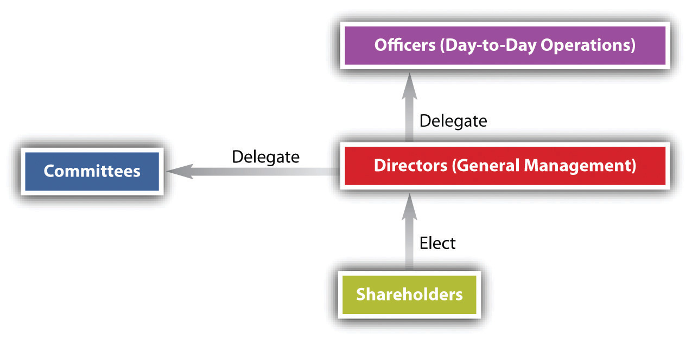

<!-- Overall style -->

<!-- Text color -->

<!-- Background images -->
<!-- {data-background=skyline.jpg data-background-size=cover} -->
<!-- concrete.jpg mountains.jpg mountains2.jpg mountains3.jpg skyline.jpg roadmap.jpg -->

<!-- Good section headers with white text -->
<!-- # Text {data-background=sander-weeteling-4LiyQSlYD-4-unsplash.jpg data-background-size=cover} -->
<!-- # Text {data-background=cristiane-teston-2iV9nqP4Y6A-unsplash.jpg data-background-size=cover} -->
<!-- # Text {data-background=christopher-burns-QaGNhezu_5Q-unsplash.jpg data-background-size=cover} -->
<!-- # Text {data-background=lobostudio-hamburg-RvQYmGfmsKo-unsplash.jpg  data-background-size=cover} -->
<!-- # Text {data-background=ali-arif-soydas-3ICVaI2uzfE-unsplash.jpg  data-background-size=cover} -->
<!-- # Text {data-background=ray-fragapane-PkKIVq1CUuY-unsplash.jpg  data-background-size=cover} -->
<!-- # Text {data-background=jeremy-bishop-_nLiAdIotdg-unsplash.jpg  data-background-size=cover} -->
<!-- # Text {data-background=richard-jacobs-8oenpCXktqQ-unsplash.jpg  data-background-size=cover} -->
<!-- # Text {data-background=carlos-quintero-7mINv5udhe8-unsplash.jpg  data-background-size=cover} -->
<!-- # Text {data-background=city1.jpg  data-background-size=cover} -->
<!--  -->

<!-- 'f' enable fullscreen mode -->
<!-- 'w' toggle widescreen mode -->
<!-- 'o' enable overview mode -->
<!-- 'h' enable code highlight mode -->
<!-- 'p' show presenter notes -->

## Motivation {data-background=birds.jpg data-background-size=cover}

Corporations are one of the oldest and most widespread business entities. By selling stock publicly, they allow massive accumulations of capital in ways that are difficult for other business entities. Since their development, much law developed surrounding their various stakeholders, particularly for how stock can and cannot be sold.

Understanding how corporations work is essential for understanding the legal environment of business, even if you do not create or are employed by one. Understanding rules for buying and selling stock is equally crucial, especially to avoid charges of insider trading.

# A little corporate history {data-background=ali-arif-soydas-3ICVaI2uzfE-unsplash.jpg  data-background-size=cover}

# {data-background=corphist/slide2.jpeg  data-background-size=contain}
# {data-background=corphist/slide3.jpeg  data-background-size=contain}
# {data-background=corphist/slide4.jpeg  data-background-size=contain}
# {data-background=corphist/slide5.jpeg  data-background-size=contain}
# {data-background=corphist/slide6.jpeg  data-background-size=contain}
# {data-background=corphist/slide7.jpeg  data-background-size=contain}
# {data-background=corphist/slide8.jpeg  data-background-size=contain}

# Forming a corporation {data-background=city1.jpg  data-background-size=cover} 

## Initial formation {data-background=birds.jpg data-background-size=cover}

- File <em>"articles of incorporation"</em> with a state
    + Delaware is popular
- Articles of incorporation include ...
    + Corporate name
    + Total number of shares
    + Purpose (e.g., "conduct lawful business")
        * <em>"Ultra vires"</em>
    + Classes of stock
    + Etc.

## Initial formation {data-background=birds.jpg data-background-size=cover}

- Organizational meeting of directors
    + Adopt bylaws
     * When shareholders meet, how to vote, method for conducting board meetings, and so on
   + Ratify promoter contracts
- <em>"De facto"</em> corporations
    + If a corporation is formed except for a technicality (such as failing to send the articles to the correct address), there was good faith effort to incorporate, and the business is being run as a corporation, then the corporation will be recognized

# Types of corporations {data-background=richard-jacobs-8oenpCXktqQ-unsplash.jpg  data-background-size=cover}

## Broad categories of corporations {data-background=birds.jpg data-background-size=cover}

- <em>Nonprofit</em> corporations
    + Liability shield, but no shareholders
- <em>Municipal</em> corporations
    * E.g., sewer authority
    * No shareholders, governed by different statutes
- <em>Closely held</em> corporations
    + Around 90% of US corporations
- <em>Public</em> corporations
    + May be traded on public exchanges, may not be
- <em>S-corporations</em>

## New corporate forms {data-background=birds.jpg data-background-size=cover}

- <em>Benefit corporations</em>
    * In some states, special corporate legal structure that specifically allows for public benefits. Allows corporations to more easily avoid liability from failure to "maximize" shareholder value
- <em>Certified B-corp</em>
    + A third-party certification, not legal status, which "measures a company's entire social and environmental performance" 
    + E.g., Ben & Jerry's
    + May require adjusting corporate bylaws or becoming a benefit corporation
- Do we need these designations?

## Liability  {data-background=birds.jpg data-background-size=cover}

- Once a corporation is created, only assets owned by the corporation can be lost in litigation against the entity.
     + With a large exception ....
- For citizenship purposes in litigation, a corporation is a citizen of the state in which it was incorporated, and the state where it maintains its "nerve center"

## Piercing the corporate veil {data-background=birds.jpg data-background-size=cover}

- In some cases, particularly for small corporations or LLCs, courts may ignore liability shields in the interest of justice. This is <em>piercing the corporate veil</em>
- Areas of concern
    * Undercapitalization
    * Failure to hold meetings
    * Commingling corporate and personal assets
- Applies to subsidiary corporations as well
- <em>"Reverse veil piercing</em>" is seizing assets transferred to a business entity to hide from personal litigation

## Practice {data-background=birds.jpg data-background-size=cover}

Two young business school graduates, Laverne and Shirley, form a consulting firm. In deciding between the partnership and corporation form of organization, they are especially concerned about personal liability for giving bad advice to their clients; that is, in the event they are sued, they want to prevent plaintiffs from taking their personal assets to satisfy judgments against the firm. Which form of organization would you recommend? Why?

## Practice {data-background=birds.jpg data-background-size=cover}

Ralph, a resident of Oklahoma, was injured when using a consumer product manufactured by a corporation whose principal offices were in Tulsa. Since his damages exceeded $10,000, he filed a products-liability action against the company, which was incorporated in Delaware, in federal court. Does the federal court have jurisdiction? Why?

# Corporate powers and management {data-background=carlos-quintero-7mINv5udhe8-unsplash.jpg  data-background-size=cover}

## Corporate organization {data-background=birds.jpg data-background-size=cover}

- <em>Board of Directors</em>
    + Has legal responsibility for the corporation and makes major decisions (e.g., mergers)
- <em>Officers </em>
    + Run the day-to-day of the corporation
- <em>Shareholders</em>
    +  Own stock, which gives ownership rights, receive dividends, if declared, vote on board members, file shareholder derivative suits
- These can overlap! Board members may be officers who may also be shareholders.

## Corporate organization

## Liability of board members {data-background=birds.jpg data-background-size=cover}

- Board members owe the shareholders a <em>fiduciary duty of loyalty and care</em>
    - This paints them with a bright target for litigation!
    - Keep insurance!
- Board members are protected by the <em>"business judgment rule"</em>, a presumption that actions are taken in the best interest of the corporation
    + Clearing self-interest and due diligence before decisionmaking will justify almost any action
    + Board members need to ensure that adequate control systems are in place within the organization

## Shareholder rights {data-background=birds.jpg data-background-size=cover}

- States establish voting rules for their corporations
    - Default rule is simple majority of shares (not shareholders) is needed for a quorum
- <em>"Cumulative voting"</em> means each shareholder has a total number of votes equal to the number of shares he owns multiplied by the number of directors to be elected. 
    + Allows minority shareholders more power in electing a board member
- Many votes are now made through <em>proxy</em>, with the SEC regulating proxy solicitation

## Shareholder derivative suits {data-background=birds.jpg data-background-size=cover}

A <em>shareholder derivative suit</em> is one brought on behalf of the corporation by a shareholder when the directors refuse to act. Although the corporation is named as a defendant in the suit, the corporation itself is the so-called real party in interest—the party entitled to recover if the plaintiff wins.

Typically, one must demand on the board to act before filing a suit (unless the plaintiff can show the board cannot exercise disinterested business judgment). Derivative actions may be dismissed if disinterested directors decide that the proceeding is not in the best interests of the corporation. The business judgment rule will protect the actions of the board in refusing to file suit! 

## A Caremark claim {data-background=birds.jpg data-background-size=cover}

Possibly the most difficult theory in corporation law. Plaintiff alleges the <em>board as a whole failed to adequately monitor the corporation</em> and the board's possible liability impairs their disinterested judgment. This failure breaches the fiduciary duty owed the investor. 

"[O]nly a sustained or systematic failure of the board to exercise oversight—such as an utter failure to attempt to assure a reasonable information and reporting system exists—will establish the lack of good faith that is a necessary condition to liability."

## Practice {data-background=birds.jpg data-background-size=cover}

What are the advantages and disadvantages of forming a corporation versus an LLC?

## Practice {data-background=birds.jpg data-background-size=cover}

Explain cumulative voting. What is the different between cumulative voting and regular voting? Who benefits from cumulative voting?

## Practice {data-background=birds.jpg data-background-size=cover}

Give an example of when <em>Caremark</em> liability might apply.

