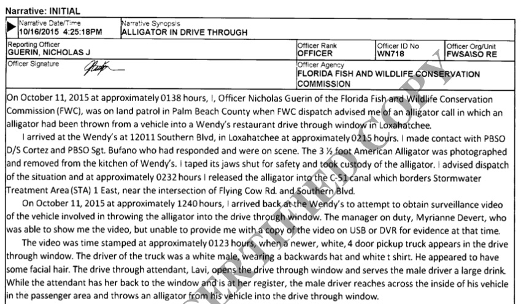

## Introduction {data-background=concrete.jpg data-background-size=cover}

Criminal law is the most ancient branch of the law. In this chapter, we will consider only the most basic aspects of intent, responsibility, and constitutional rights.

Unlike civil actions, where plaintiffs seek compensation or other remedies for themselves, crimes involve “the state” (the federal government, a state government, or some subunit of state government). This is because crimes involve some “harm to society” and not just harm to certain individuals. But “harm to society” is not always evident in the act itself ....

## Civil versus criminal law {data-background=concrete.jpg data-background-size=cover}

- **Who** sues?
- **Why** do they sue?
- **What**  is the burden to prove their case?
- What are the possible **penalties**?

## Elements of a crime {data-background=concrete.jpg data-background-size=cover}

- Actus reus: criminal action
	+ _Do_ something prohibited
- Mens rea: criminal intent
	+ With the requisite criminal _intent_, e.g.,:
		+ Actual intent (e.g. first degree murder)
		+ Criminal negligence (e.g. involuntary manslaughter)

Criminal thoughts with no action? Not a crime. Criminal actions with no intent? (Traditionally) not a crime.

## Elements of a crime {data-background=concrete.jpg data-background-size=cover}

- Actus reus: criminal action
	+ _Do_ something prohibited
- Mens rea: criminal intent
	+ With the requisite criminal _intent_, e.g.,:
	+ Actual intent (e.g. first degree murder)
	+ Criminal negligence (e.g. involuntary manslaughter)

Criminal thoughts with no action? Not a crime. Criminal actions with no intent? (Traditionally) not a crime.

But strict liability is swallowing mens rea requirements. E.g., a speeding ticket!

# Practice: Is an alligator a "deadly weapon"? {data-background=david-clode-3udd_NEmgDs-unsplash.jpg data-background-size=cover}

## The incident report ... {data-background=concrete.jpg data-background-size=cover}

## What is a deadly weapon? {data-background=concrete.jpg data-background-size=cover}

Fla. Stat. 790.001: “Weapon” means any dirk, knife, metallic knuckles, slungshot, billie, tear gas gun, chemical weapon or device, or other deadly weapon except a firearm or a common pocketknife, plastic knife, or blunt-bladed table knife.

## What is a deadly weapon? {data-background=concrete.jpg data-background-size=cover}

Fla. Stat. 790.001: “Weapon” means any dirk, knife, metallic knuckles, slungshot, billie, tear gas gun, chemical weapon or device, **or other deadly weapon** except a firearm or a common pocketknife, plastic knife, or blunt-bladed table knife.

## How have courts interpreted this? {data-background=concrete.jpg data-background-size=cover}

Michaud v. State, 47 So. 3d 374 (Fla. Dist. Ct. App. 2010):

An instrument that will likely cause death or great bodily harm when used in the ordinary and usual manner contemplated by its design is a deadly weapon.  However, an object can also be found to be a deadly weapon if used or threatened to be used in a way likely to produce death or great bodily harm. See, e.g., Vincente v. State, 669 So. 2d 1119 (Fla. 3d DCA 1996) (screwdriver constituted deadly weapon where it was employed by defendant as knife with which to stab victim); Coronado v. State, 654 So. 2d 1267 (Fla. 2d DCA 1995) (sticks used to repeatedly strike victims constituted deadly weapons); Fletcher v. State, 472 So. 2d 537 (Fla. 5th DCA 1985) (razor blade held to victim's throat during attempted robbery could be found to be deadly weapon). 

## How have courts interpreted this? {data-background=concrete.jpg data-background-size=cover}

Brown v. State, 86 So. 3d 569 (Fla. Dist. Ct. App. 2012)

This evidence not only fails to establish that the broomsticks were deadly weapons, it clearly establishes that they are not. The broomsticks were made out of hollow plastic and were so flimsy that they bent when Brown struck the victim. The victim suffered no injury and testified that it only stung when she was struck with the broomsticks. When Brown saw he could not injure the victim with the broomsticks, he folded them in his hand and stopped using them. If there is any fact established by this testimony, it is that the broomsticks are not deadly weapons because they were not likely to cause great bodily harm. 

## How have courts interpreted this? {data-background=concrete.jpg data-background-size=cover}

Lee v. State, 100 So.3d 1183 (2012)

At the outset of our analysis, we observe that the legal reasoning involved in deciding whether a shoe is a "deadly weapon" is somewhat unusual. It is unusual due to a combination of two factors. First, a shoe is not inherently a deadly weapon; its use determines whether it falls within this category. The standard jury instructions explain that a weapon is a "deadly weapon" if it is "used or threatened to be used in a way likely to produce death or great bodily harm." Fla. Std. Jury Instr. (Crim.) 8.2, 8.4. Second, the case law generally recognizes that a person's hands and feet, at least in the absence of special training, are not deadly weapons. See Davis v. State, 565 So.2d 826 (Fla. 5th DCA 1990) (evidence that a defendant used a hand or foot in a battery does not establish aggravated battery); Dixon v. State, 603 So.2d 570 (Fla. 5th DCA 1992) (en banc) (generally bare hands are not deadly weapons).

See https://web.archive.org/web/20200206220310/https://loweringthebar.net/2016/02/is-an-alligator-a-deadly-weapon.html

## One more ... {data-background=ks-kyung-xNJJvB0AkZ8-unsplash.jpg data-background-size=cover}

<a href="https://web.archive.org/web/20200206220352/https://loweringthebar.net/2015/12/utah-woman-charged-with-causing-egg-catastrophe.html">Is egging an act of terrorism?</a>

## Types of crimes: examples {data-background=concrete.jpg data-background-size=cover}

- Murder: 1st degree
	+ A person commits the crime of murder in the first degree if he knowingly causes the death of another person after deliberation upon the matter.
- Murder: 2nd degree
	+ A person commits the crime of murder in the second degree if he knowingly causes the death of another person or, with the purpose of causing serious physical injury to another person, causes the death of another person
- Manslaughter
	+ Causes the death of another person under circumstances that would constitute murder in the second degree ... except that he caused the death under the influence of sudden passion arising from adequate cause

## Types of crimes: examples {data-background=concrete.jpg data-background-size=cover}

- Rape
	+ A person commits the offense of rape in the first degree if he or she has sexual intercourse with another person who is incapacitated, incapable of consent, or lacks the capacity to consent, or by the use of forcible compulsion. Forcible compulsion includes the use of a substance administered without a victim's knowledge or consent ....
- Burglary
	+ The breaking and entering of the dwelling of another in the nighttime with intent to commit a felony. 
- Larceny
	+ The wrongful taking and carrying away of the personal property of another with intent to steal the same.
- Robbery
	+ Larceny from a person by means of violence or intimidation.

#
<iframe width="560" height="315" src="https://www.youtube.com/embed/QfAe6Z3eAF4" frameborder="0" allow="accelerometer; autoplay; encrypted-media; gyroscope; picture-in-picture" allowfullscreen></iframe>

## Fourth Amendment {data-background=fountainpen.jpg data-background-size=cover}

The right of the people to be secure in their persons, houses, papers, and effects, against unreasonable searches and seizures, shall not be violated, and no Warrants shall issue, but upon probable cause, supported by Oath or affirmation, and particularly describing the place to be searched, and the persons or things to be seized.

## Criminal procedure: Applied constitutional law {data-background=concrete.jpg data-background-size=cover}

- Terry stops
	+ Police can briefly detain / pat down when there is “reasonable suspicion” of criminal activity
	+ Reasonable suspicion means “specific and articulable facts” based on surrounding circumstances
	+ Reasonable suspicion for detainment ("stop") and pat down ("frisk") are different
- Warrants 
	+ **Unless** an exception applies, and **if** there is a reasonable expectation of privacy, police need a warrant to search or seize 
	+ Trash? Flyovers? Thermal imaging? Drop something while running from police?
- If there is expectation of privacy, you need probable cause and a warrant 
	+ Unless an exception applies ....

#
<iframe width="560" height="315" src="https://www.youtube.com/embed/RyJFD6BhQFY" frameborder="0" allow="accelerometer; autoplay; encrypted-media; gyroscope; picture-in-picture" allowfullscreen></iframe>

## Exceptions to the warrant requirement: cars {data-background=concrete.jpg data-background-size=cover}

- Police only need reasonable suspicion to pull you over, but need probable cause to do more than investigate briefly
	+ With probable cause, police can conduct full search without a warrant
- During an otherwise lawful traffic stop, police can run a dog around the car without reasonable suspicion of drug use 
	+ Why? Dogs only find illegal drugs -- no expectation of privacy
	+ But police can’t make you wait to bring dogs in-- would be unreasonable without PC.
- Police can also make you exit a vehicle on a routine stop, but have to have probable cause to search within the car.
	+ If they have probable cause to search within the car, they can also search containers inside the car

## Checkpoints {data-background=concrete.jpg data-background-size=cover}

- Checkpoints for “ordinary” criminal activity are probably unconstitutional
	+ Why??
- DUI checkpoints are constitutional, so long as they are brief (e.g., smell your breath, glance in your car). 
	+ Upheld on same principle as Terry stops--the constitutional concern is minimal compared to the need for public safety
- Random drug checkpoints are **not** constitutional
	+ But warning signs for a “fake” checkpoint are okay!
- _Pulling you over for no reason is definitely not constitutional_

## Exceptions to the Warrant Requirement {data-background=concrete.jpg data-background-size=cover}

- Emergency 
- Plain sight 
- Arrests
- Consent
	+ Counts even if you don’t know you can refuse
	+ Roommates?

## The Exclusionary Rule {data-background=concrete.jpg data-background-size=cover}

- Evidence obtained illegally is not admissible at trial
	+ Fruit of the poisonous tree
	+ But can the Constitution bear this?!

## Miranda Rights {data-background=concrete.jpg data-background-size=cover}

- _Miranda v. Arizona_
- Particular words are not required
	+ Should Miranda apply when there is no question about guilt?
- Once you unequivocally ask for an attorney, questioning must stop
	+ So every cop show you’ve ever seen gets it wrong ....
	+ Being silent is not enough to invoke the right to remain silent! 
- Miranda applies once you are in custody
	+ Arrest = custody (although routine booking questions don’t count)
	+ Traffic stop ≠ custody
	+ Halfway house? Show up voluntarily with the police?
	+ Undercover cops?
	+ Bomb about to go off?

## Qualified immunity {data-background=concrete.jpg data-background-size=cover}

- What if you believe the police have broken the law and want to sue them personally?
- Qualified versus absolute immunity: act in clear violation of well-established law
	+ Tase the wrong person?
	+ Someone goes blind in jail for lack of medication?
- _Milan v. Bolin_ (flash grenades and 11 member SWAT team against teenager with no investigation)

<!-- 'f' enable fullscreen mode -->

<!-- 'w' toggle widescreen mode -->

<!-- 'o' enable overview mode -->

<!-- 'h' enable code highlight mode -->

<!-- 'p' show presenter notes -->
