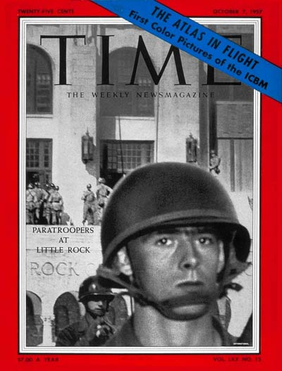
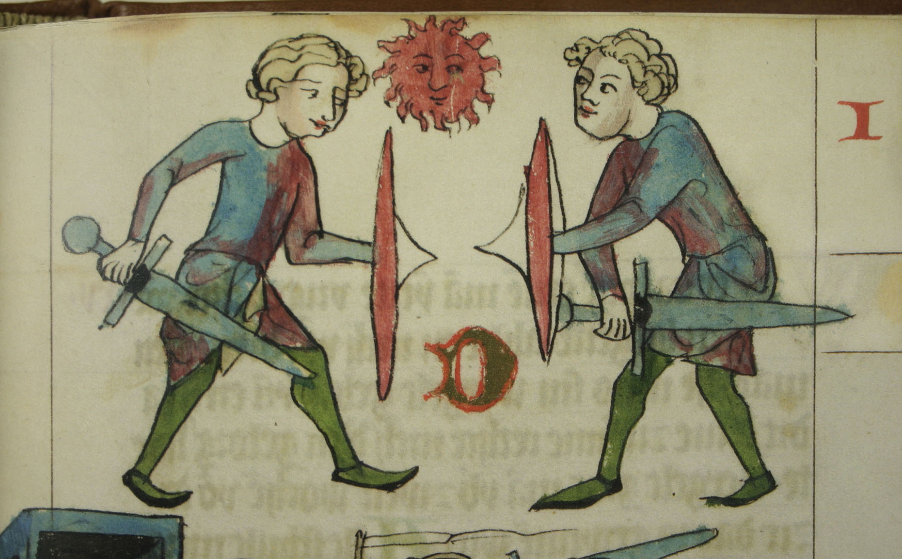
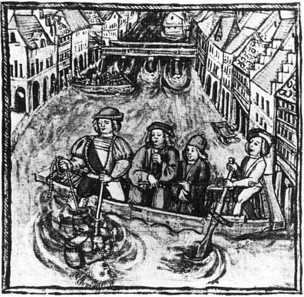
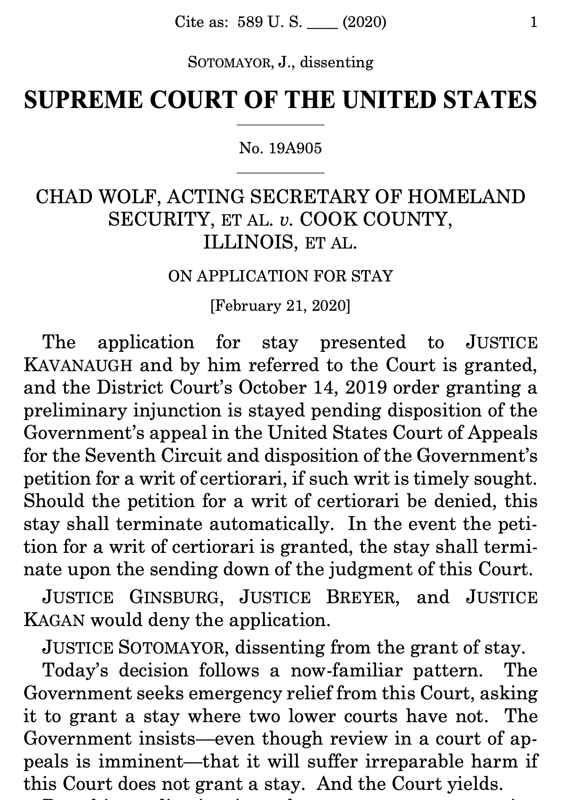

<!-- Overall style -->

<!-- Text color -->

<!-- Background images -->
<!-- concrete.jpg mountains.jpg skyline.jpg roadmap.jpg parrot.jpg blackdunes.png-->
<!-- If you use parrots, specify this under body p in the css notes:   width: 750px; -->
<!-- {data-background=skyline.jpg data-background-size=cover} -->
<!-- 

Footer text

 -->

# {data-background=Verdun.jpeg data-background-size=cover}

<!-- You can tell where WW1 was fought due to the scars in the landscape -->

<!-- I've never suffered a horrific injury, but life happens. Like the scar on my nose from chickenpox when I was young, life leaves its marks -->

<!-- Sometimes actions allowed by the law have left horrific scars, both literal -->

# {data-background=gordon.jpg data-background-size=cover}

<!-- And figurative  -->

# 13th Amendment

Neither slavery nor involuntary servitude, except as a punishment for crime whereof the party shall have been duly convicted, shall exist within the United States, or any place subject to their jurisdiction.

<!-- We have the 13th, 14th, and 15th Amendment as scars from the civil war-- evidence the law fixed the wound of slavery, in part -->

## {data-background=blackdunes.png data-background-size=cover}

<!-- And then we have Brown v. Board of Education, which meant the wound hadn't fully healed, and many would stay still hasn't fully healed -->

<!-- The cases we study, the statutes and constitutional provisions, are the scars on the landscape of our struggle with ourselves. That is the law. If men were angels, none of this class would exist. Because we wrestle with each other, with right and wrong, we generate law. The common law represents the combined outcome of many wrestling matches, the Constitution represents the outcome of another immense conflict, both ideaologically and physically. And so on. The Reconstruction Amendmnents another, and so on, and so on, up through cases on gun rights, gay marriage, and so on.-->

# Why study law?
<!-- If law, in a sense, is an ugly scar on the history of society, why study it? -->

# Truth?

<!-- If not, perhaps a record of us struggling with truth -->

## {data-background=blackdunes.png data-background-size=cover}

## {data-background=blackdunes.png data-background-size=cover}

## {data-background=blackdunes.png data-background-size=cover}

# {data-background=The_Jury_by_John_Morgan.jpg data-background-size=cover}

#

# Justice?

<!-- What, 200 years from now, will we look back on like trial by combat? -->

# Beauty?
<!-- Like a class on opera, or classical art -->

<!-- No, but we do talk about how to preserce and use beauty, through copyright law -->

<!-- But then, law does provide milestones and marks the beauty in our lives. A marriage license, a birth certificate,  -->

<!-- I'm tempted to joke about a jury duty summons -->

## Is it useful? {data-background=blackdunes.png data-background-size=cover}

## Is it useful? {data-background=blackdunes.png data-background-size=cover}

1. Knowing substantive rights is <em>power</em>
2. Knowing procedural rights is <em>powerful</em>
3. Knowing legal analytics is <em>empowering</em>

# What kind of power? To change the world. 

<!-- Sometimes you should use the law. Right wrongs. Get your security deposit back. Defend your intellectual property. -->

# Or to forbear .... {data-background=blackdunes.png data-background-size=cover}

# {data-background=sharon-mccutcheon-rItGZ4vquWk-unsplash.jpg data-background-size=cover}

## Lottery winners? {data-background=blackdunes.png data-background-size=cover}

- Good evidence suggests winning the lottery does <em>not</em> make you happy.

## Lottery winners? {data-background=blackdunes.png data-background-size=cover}

- Good evidence suggests winning the lottery does <em>not</em> make you happy.
- Good evidence suggests increasing GDP does not make societies happier.

## Lottery winners? {data-background=blackdunes.png data-background-size=cover}

- Good evidence suggests winning the lottery does <em>not</em> make you happy.
- Good evidence suggests increasing GDP does not make societies happier.
- Would winning the legal lottery, so to say? 

## Lottery winners? {data-background=blackdunes.png data-background-size=cover}

- Good evidence suggests winning the lottery does <em>not</em> make you happy.
- Good evidence suggests increasing GDP does not make societies happier.
- Would winning the legal lottery, so to say? 
- And if not, was this class <em>actually</em> useful?

## Happiness, a marginal approach {data-background=blackdunes.png data-background-size=cover}

>- Make money, but not too much
>- Work, but not too much
>- Keep your commute under 22 minutes
>- Live near water, in a medium-sized city
>- Find funny friends
>- Reject comparison as a basis for self-worth

# And sometimes, <em>let it go</em>

# {data-background=travis.jpg data-background-size=cover}

# And sometimes, <em>let it go</em>

<!-- Sometimes, suing someone isn't going to heal you. Sometimes you'll be happier by just ignoring everything I've taught you. Law is a power tool, and sometimes it's best left alone. -->

